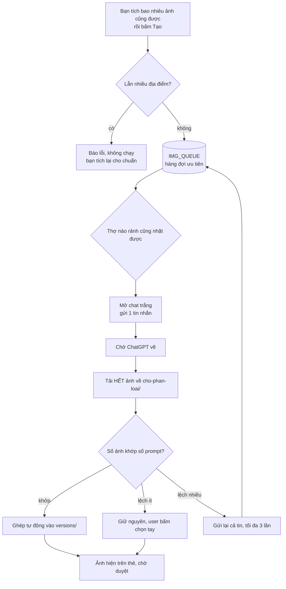
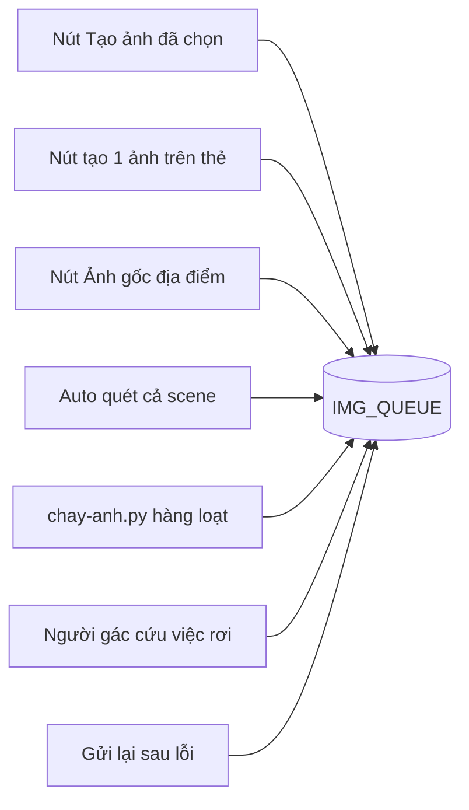
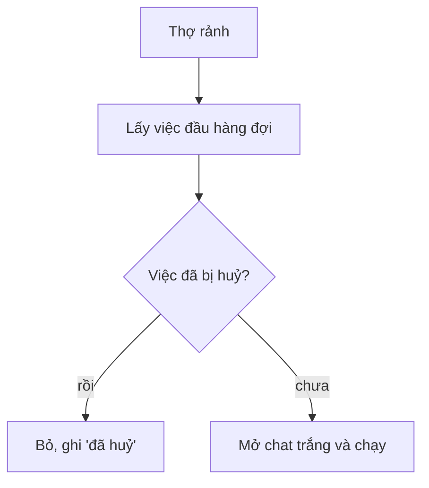
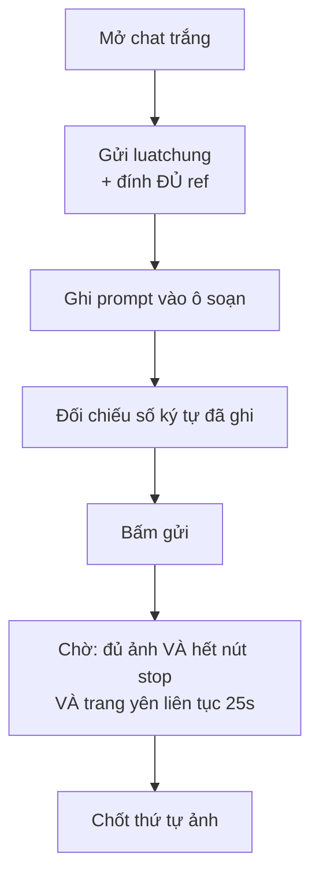
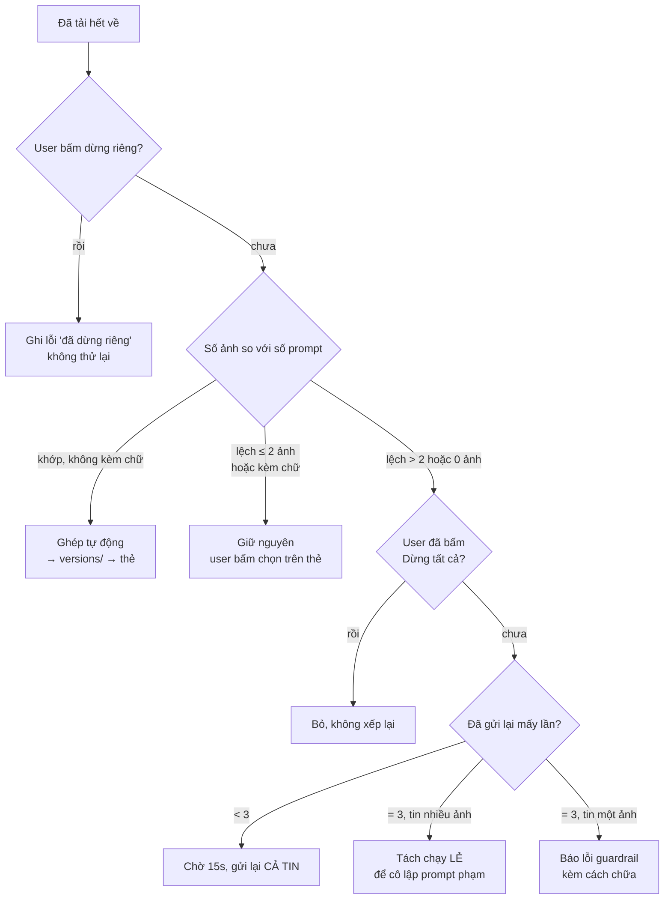

# Sơ đồ tạo ảnh SF — toàn bộ đường đi

Bản đồ đầy đủ của khâu **vẽ ảnh Start Frame**: từ lúc bấm nút tới lúc ảnh nằm trong
`assets/`, kèm mọi ngã rẽ khi hỏng. Muốn tinh chỉnh gì thì tra bảng cuối file — mỗi
hành vi có ghi **chỉnh ở đâu**.

Video (Grok) đi đường khác, không nằm trong file này.

---

## 1. Toàn cảnh



Bốn thứ chi phối toàn bộ, hiểu bốn cái này là hiểu cả hệ:

| Khái niệm | Nghĩa |
|---|---|
| **Tích gì gửi nấy** | Bạn tự tích các thẻ muốn vẽ cùng nhau. Chúng đi trong **đúng một tin nhắn**, vẽ cùng lúc nên đồng bộ với nhau. **Không giới hạn số ảnh** — tích bao nhiêu gửi bấy nhiêu. |
| **Luôn chat trắng** | Mỗi lần chạy mở một đoạn chat mới, gửi lại luật chung và đính lại đủ ref. Board **không nhớ** đoạn chat nào cả. |
| **Một lần một địa điểm** | Tích lẫn hai địa điểm thì board **báo lỗi, không cho chạy** — một tin nhắn chỉ mang được một khối `luatchung`. Bạn tự tích lại cho chuẩn. |
| **Ident** | Tên của một việc trong hàng đợi: `LO:SF-S3-01,SF-S3-02,…` (tên nội bộ, giữ nguyên cho khỏi phải sửa hàng loạt) |

---

## 2. Lối vào — việc từ đâu ra



| Lối vào | Ghi chú |
|---|---|
| **Tạo ảnh đã chọn** | Tích thẻ nào gửi thẻ đó, **bao nhiêu ảnh cũng được, luôn đúng một tin**. Lẫn địa điểm thì báo lỗi. Bấm là chạy, không hỏi lại. |
| **Tạo 1 ảnh trên thẻ** | Cũng là một tin nhắn, chỉ chứa một ảnh — vẫn có `luatchung`. |
| **Ảnh gốc địa điểm** | Chỉ chạy các thẻ địa điểm còn thiếu ảnh. |
| **Auto cả scene** | Vòng quét tự bù ảnh thiếu, tự bắn lại cái lỗi, xong scene thì tự tắt. |
| **`chay-anh.py`** | Chạy hàng loạt ngoài giao diện: master trước, SF con sau. |
| **Người gác** | Mỗi 30 giây, cứu việc mang nhãn "chờ" mà đã rơi khỏi hàng đợi. |
| **Gửi lại sau lỗi** | Tin bị guardrail chặn tự quay lại hàng, tối đa 3 lần. |

---

## 3. Thứ tự trong hàng đợi

Hàng đợi **không phải FIFO**. Nó xếp theo **vị trí shot trong tab video**:

```
tab video : B1 01 02 03 05 06 B2 07 08 09 …
hàng đợi  : B1 01 02 03 05 06 B2 07 08 09 …   ← khớp đúng
```

- Thứ tự đọc từ `shots[]`, **không suy từ tên SF**. Tên có hậu tố chữ (`SF-S3-B1`) vẫn
  đúng chỗ — trước đây suy từ tên nên mọi thẻ `B` rơi xuống cuối.
- `REF_…` và thẻ master luôn ưu tiên **0** (chạy trước hết).
- SF không thuộc shot nào → rơi xuống đáy.
- Cùng ưu tiên thì giữ FIFO (ai xếp trước chạy trước).

---

## 4. Thợ nhặt việc



Từ 2026-08-12 phần này **đơn giản hẳn**. Trước đây nó là chỗ rắc rối nhất của cả hệ:
khoá địa điểm, hàng chờ khoá, giao việc đích danh cho tài khoản đang giữ chat, cân bằng
chat giữa các tài khoản — bốn tầng luật ngầm, và phần lớn lỗi "board đứng im mà tài
khoản vẫn rảnh" đều đẻ ra từ đó.

Vì board không nhớ đoạn chat nữa nên **mọi việc chạy được trên mọi tài khoản**. Không
còn "chat này chỉ mở được ở tài khoản kia", nên cũng không cần khoá, không cần giao
đích danh, không cần cân bằng.

Hai việc cùng một địa điểm giờ **chạy song song được** trên hai tài khoản. Đổi lại,
chúng nằm ở hai đoạn chat khác nhau nên không đồng bộ với nhau — muốn đồng bộ thì tích
chúng chạy chung một lần.

---

## 5. Cổng chặn trước khi gửi

Ba cửa phải qua, theo đúng thứ tự:

| # | Cửa | Không qua thì |
|---|---|---|
| 1 | **Thẻ địa điểm đã có ảnh chưa?** | Dừng. Ảnh thẻ địa điểm là bản neo khoá màu · ánh sáng · trục cho cả cụm; chạy khung con trước là mỗi khung tự bịa một look. |
| 2 | **SF đã có ảnh rồi?** | Bỏ khỏi tin, không vẽ lại. Lọc lại ngay trước khi gửi vì hàng đợi nằm trong RAM và có thể cũ. |
| 3 | **Còn tài khoản nào sống không?** | Hết tài khoản thì việc ghi lỗi và nằm chờ; bật lại Chrome ở ⚙ Tài khoản là chạy tiếp. |

---

## 6. Gửi tin nhắn và chờ vẽ



Vài điểm dễ hỏng, đã trả giá:

- **Đính ĐỦ ref mỗi lần.** Chat trắng thì model không có trí nhớ gì; thiếu ref là nó tự
  bịa mặt và trang phục — hỏng câm, không có thông báo nào. Mỗi nhân vật cần cả
  `_PORTRAIT` (neo mặt) lẫn `_FULL` (neo trang phục).
- **Phải chờ trang yên liên tục 25 giây** rồi mới đọc thứ tự ảnh. Đủ ảnh + hết nút stop
  vẫn chưa xong: lúc ChatGPT đang chốt lượt, thumbnail còn sắp xếp lộn xộn. Đọc sớm là
  gắn ảnh lộn thẻ.
- **Không tin phép đếm 300 giây**: nút Stop không tồn tại xuyên suốt lúc ChatGPT nghĩ
  ngầm. Im lặng lâu mà không có chữ từ chối rõ ràng thì vẫn chờ tiếp.
- **`luatchung` gửi ở đầu mỗi tin nhắn.** Phần lặp của địa điểm (nội thất · bảng màu ·
  ánh sáng · trang phục · trục) viết vào `luatchung`, đừng chép vào từng `prompt`.

---

## 7. Ảnh về rồi — phân loại

**Luật gốc: tải hết về trước khi phán.** Ảnh đã sinh là lượt đã tiêu, không được vứt vì
một phép đếm. Mọi ảnh vào `cho-phan-loai/turn-NNNN/` theo đúng thứ tự hiển thị.



Vì sao chia ba mức:

- **Lệch ít (≤ 2 ảnh)** — thường guardrail từ chối *một* ảnh giữa tin. Ảnh đã có trong
  tay rồi, gửi lại là đốt thêm một lượt để mua lại thứ mình đã có. Nên giữ nguyên cho
  user bấm chọn.
- **Lệch nhiều / 0 ảnh** — gần như chắc cả lượt bị chặn, và phần lớn chỉ cần **gửi lại
  nguyên lô** là qua. Đây là đường chính vì nó giữ được tốc độ của lô.
- **Tách chạy lẻ** chỉ là đường cùng sau 3 lần cả lô đều trượt: lúc đó gần như chắc có
  một prompt phạm thật, và chạy lẻ là cách duy nhất chỉ ra nó.

**Số ảnh khác số prompt thì không bao giờ ghép tự động.** Lệch một nấc là ảnh gắn nhầm
SF, mà ảnh cùng địa điểm trông na ná nhau nên mắt rất khó bắt.

---

## 8. Bảng đầy đủ các trường hợp hỏng

### 8.1 Hỏng ở phía ChatGPT

| Trường hợp | Board làm gì | Bạn cần làm gì |
|---|---|---|
| Guardrail chặn cả lượt (0 ảnh) | Gửi lại cả tin, tối đa 3 lần, cách nhau 15s | Chờ |
| Guardrail chặn 1 ảnh giữa tin | Giữ ảnh đã về, ghi "bấm chọn trên thẻ" | Bấm chọn ảnh trên thẻ |
| Trượt 3 lần liền, tin nhiều ảnh | Tách chạy lẻ từng ảnh | Chờ, rồi xem ảnh nào lỗi |
| Trượt 3 lần, tin một ảnh | Báo lỗi kèm hướng chữa | Sửa prompt: bớt chữ nhấn vào gương mặt, đổi vài chi tiết bố cục, hoặc đổi ref |
| Lượt trả kèm chữ | Coi là lỗi, giữ ảnh, để user chọn | Bấm chọn trên thẻ |
| Thừa ảnh | Giữ nguyên, để user chọn | Bấm chọn trên thẻ |
| **Hết lượt tạo ảnh** | Đánh dấu tài khoản chết, chuyển việc sang tài khoản khác | Không |
| **Hết lượt đính tệp (có hẹn giờ)** | Cho tài khoản nghỉ tới đúng giờ rồi tự sống lại; mở Chrome dự phòng | Không |

### 8.2 Hỏng ở phía trình duyệt / máy

| Trường hợp | Board làm gì | Bạn cần làm gì |
|---|---|---|
| Tab bị đóng | Nhả phiên, mở lại tab, thử lại **cùng tài khoản** | Không |
| Tab crash (hết RAM) | Như trên — nhận diện qua `target crashed` | Giảm số tab / cửa sổ nếu lặp lại |
| Cửa sổ Chrome bị đóng | Đánh dấu chết, chuyển sang tài khoản khác; Chrome mở lại thì tự hồi sinh | Mở lại Chrome ở ⚙ Tài khoản |
| Kết nối CDP đứt | Phát hiện bằng `is_connected()`, dựng lại kết nối | Không |
| **Chrome "sống nửa vời"** — HTTP trả lời nhưng WebSocket treo | Không tự chữa được | Dừng board → đóng hết Chrome debug → mở lại board → mở lại Chrome. Khởi động lại riêng một đầu **không đủ**. |

### 8.3 Hỏng ở phía hàng đợi

| Trường hợp | Board làm gì | Bạn cần làm gì |
|---|---|---|
| Việc mang nhãn "chờ" mà đã rơi khỏi hàng đợi | Người gác gom lại và xếp lại, tối đa 3 lần | Không |
| Rơi khỏi hàng 3 lần | Ghi lỗi "bấm chạy lại" | Bấm chạy lại |
| Hai việc cùng địa điểm | **Chạy song song được** (từ 2026-08-12). Chúng ở hai chat khác nhau nên không đồng bộ với nhau | Muốn đồng bộ thì tích chạy chung một lần |
| Tất cả tài khoản đều bận | Việc nằm chờ tới lượt | Chờ, hoặc thêm tài khoản/tab |
| Tích lẫn nhiều địa điểm | **Không xếp gì cả**, báo rõ địa điểm nào gồm thẻ nào | Bỏ tích để chỉ còn một địa điểm |

### 8.4 Khi bạn chủ động dừng

| Nút | Tác dụng | Ảnh đang vẽ |
|---|---|---|
| **✕ trên một việc đang chờ** | Vứt khỏi hàng đợi | — |
| **■ trên một việc đang chạy** | Bấm nút Stop của ChatGPT, cắt thật, không đụng việc khác | Mất |
| **Huỷ việc đang chờ** | Vứt mọi việc chưa chạy | Việc đang chạy vẫn chạy nốt |
| **Dừng tất cả** | Tắt auto, vét hàng đợi, **bấm Stop trên mọi đoạn chat**, đóng Chrome | Mất |

**Vì sao Dừng tất cả phải bấm Stop chứ không chỉ đóng Chrome:** việc sinh ảnh chạy ở
phía máy chủ OpenAI, không phải trong trình duyệt. Đóng cửa sổ chỉ làm mình hết nhìn
thấy — lượt đó vẫn vẽ tiếp, vẫn tính vào hạn mức, mở lại Chrome là thấy nó vẫn chạy.

Sau khi Dừng tất cả, **người gác không được cứu việc lên nữa** — việc rơi khỏi hàng lúc
đó là đúng ý bạn.

---

## 9. Trạng thái hiện trên hàng đợi

| Nhãn | Nghĩa |
|---|---|
| `chờ` | Trong hàng đợi, chưa tới lượt |
| `N ảnh [tk 2/2] · chat mới · đính k ref` | Đang chạy |
| `ChatGPT chặn/thiếu ảnh (x/y) — gửi lại cả lô, lần k/3` | Đang thử lại |
| `lượt N: thiếu k ảnh — đã TẢI VỀ, bấm chọn ngay trên thẻ` | Cần bạn chọn tay |

**Nhãn ở đây là dấu vết đã ghi, không phải hàng đợi thật.** Hai thứ có thể lệch nhau.
Muốn biết hàng đợi thật thì mở `/api/chan-doan` (mục 11).

---

## 10. Các ngưỡng — chỉnh ở đâu

| Ngưỡng | Giá trị | Chỉnh ở | Cân nhắc trước khi đổi |
|---|---|---|---|
| Ảnh tối đa khi **bạn tích** | **không giới hạn** | — | Tích bao nhiêu gửi bấy nhiêu, luôn đúng một tin |
| Ảnh tối đa khi **máy tự gom** | **10** | `sfboard/hangdoi.py` · `TRAN_MAY_TU_GOM` | Chỉ áp cho auto quét và người gác — để máy đừng tự dồn cả scene vào một tin khi không ai nhìn |
| Lệch bao nhiêu ảnh thì vẫn giữ | **2** | `sfboard/sfboard.py` · `PL_LECH_TOI_DA` | Nới rộng = ít gửi lại hơn nhưng phải chọn tay nhiều hơn |
| Số lần gửi lại cả tin | **3** | `sfboard/sfboard.py`, tìm `_gr = "GR:"` | Tăng = tốn lượt; giảm = tách chạy lẻ sớm |
| Giữ bao nhiêu lượt trong hộp chờ | **40** | `sfboard/sfboard.py` · `PL_GIU_TOI_DA` | Giữ nhiều tốn đĩa, ít thì mất chỗ dịch ảnh sang thẻ khác |
| Giây trang phải yên trước khi chốt thứ tự | **25** | `image_chatgpt.py`, tìm `YEN = 25.0` | Giảm là gắn ảnh lộn thẻ |
| Hạn tổng chờ một lượt | **300s** | `image_chatgpt.py` · `gen_timeout` | |
| Tab tối đa một tài khoản | **6** | `sfboard/sfboard.py` · `MAX_TABS` | Mỗi tab thêm là thêm RAM; nhiều tab **không** nhân được hạn mức |
| Người gác quét mỗi | **30s** | `sfboard/sfboard.py` · `_gac_hang_doi` | |
| Ref nặng hơn thì thu nhỏ | **1200 KB / cạnh 1600** | `image_chatgpt.py` · `_REF_TRAN_KB`, `_REF_CANH_MAX` | |

## 11. Chỉnh hành vi — tra ở đây

| Muốn đổi | Sửa ở |
|---|---|
| Thứ tự chạy trong hàng đợi | `hangdoi.py` · `uu_tien()` / `thu_tu_shot()` |
| Luật "một lần một địa điểm" | `sfboard.py` · `_lan_dia_diem()` |
| Trần khi máy tự gom | `sfboard/hangdoi.py` · `TRAN_MAY_TU_GOM` |
| Nút "Tạo ảnh đã chọn" và thanh chọn | `ui/board.js` · `loChay()`, `veLoBar()` |
| Cổng chặn "thẻ địa điểm phải có ảnh trước" | `sfboard.py` · `_cong_master()` |
| Xử lý khi số ảnh lệch | `sfboard.py` · `_generate_lo_ruot()`, đoạn "LƯỢT LỆCH" |
| Cứu việc rơi khỏi hàng | `sfboard.py` · `_gac_hang_doi()` |
| Nhận diện lỗi hết lượt / tab chết | `sfboard.py` · `_is_quota_error()`, `_is_dead_session_error()` |
| Selector, mọi đoạn JS chạy trong trang | `grokpipe/executors/dom_chatgpt.py` |
| Cách đính ref, gửi prompt, chờ ảnh | `image_chatgpt.py` · `generate_lo()` |
| Giao diện hàng đợi | `sfboard/ui/board.js`, `board.css` |

## 12. Soi khi hàng đợi đứng im

```bash
curl -s http://localhost:8782/api/chan-doan | python3 -m json.tool
```

| Trường | Đọc thế nào |
|---|---|
| `hang_doi.anh` | Số việc **thật** trong hàng. Lệch với số "chờ" trên giao diện = có việc mồ côi |
| `tho` | `cổng·loại·slot: true` = thợ còn sống |
| `chet` | Tài khoản bị đánh dấu chết và lý do |
| `lo_dang_hoan` | Việc nào đang phải thử lại, và bao nhiêu lần |
| `da_huy` | Việc user đã huỷ |
| `dung_gen` | Số lần đã bấm "Dừng tất cả" |

**Đứng im mà `tho` đủ và `chet` rỗng** → nghi việc mồ côi: nhãn "chờ" còn mà hàng đợi
rỗng. Người gác sẽ cứu trong 30 giây; không cứu được thì bấm chạy lại.

---

## 13. Ba luật cứng, đừng phá

1. **Ảnh đã duyệt là bản đã chốt.** Không xoá, không ghi đè, không "nâng cấp" lên bản
   nét hơn trong `versions/`. Nghi sai thì báo, để user quyết.
2. **Đính đủ ref mỗi lần chạy.** Mỗi tin là một chat trắng, model không nhớ gì từ lần
   trước; thiếu ref là nó tự bịa mặt và trang phục — hỏng hoàn toàn im lặng.
3. **Tải hết ảnh về trước khi phán.** Lượt đã sinh là lượt đã tiêu.
