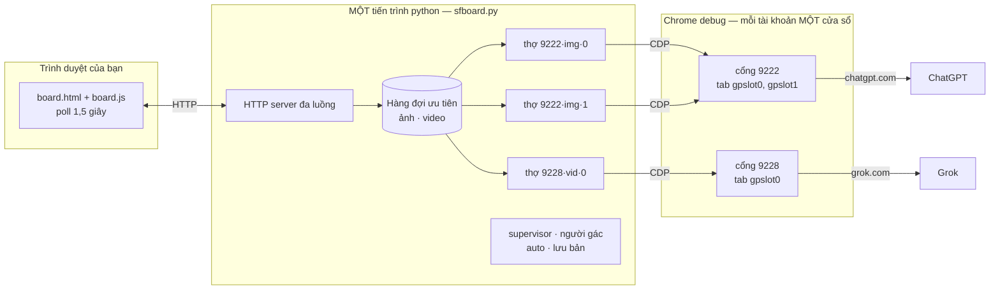
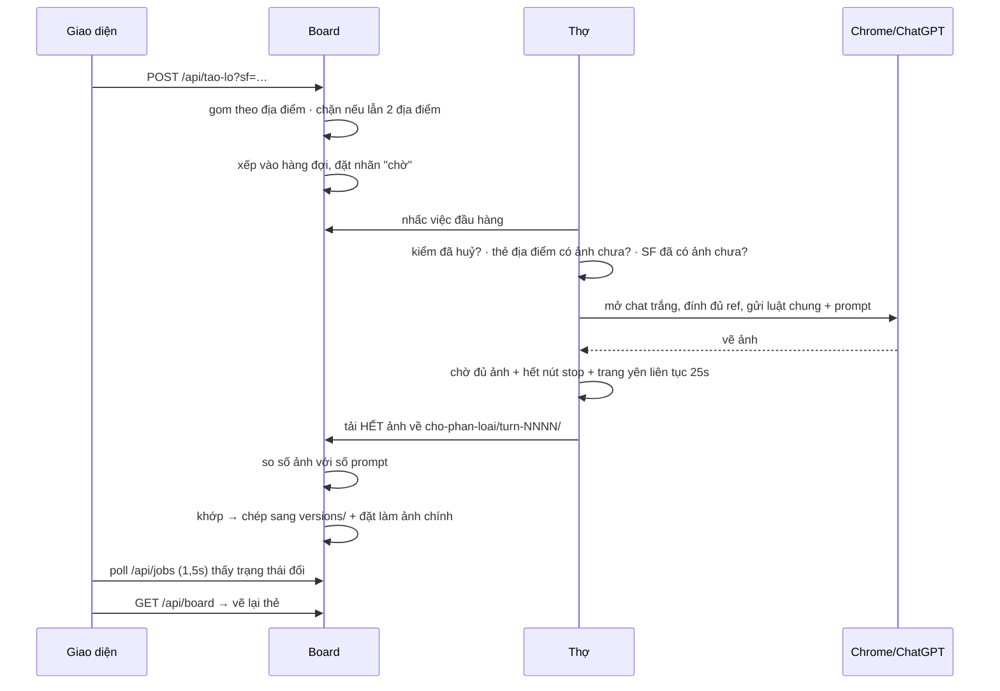
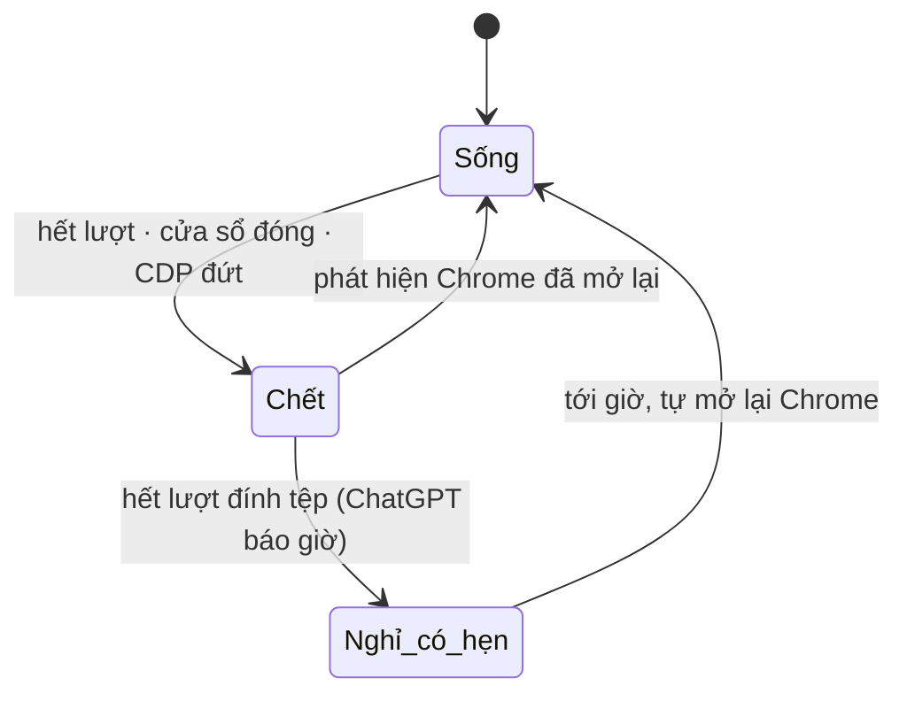

# App đang chạy hoạt động thế nào — khâu tạo ảnh SF

Mô tả **hệ thống đang chạy thật**: tiến trình nào, luồng nào, dữ liệu nằm ở đâu, một
việc đi qua những chặng nào. Bảng ngưỡng và "muốn đổi X thì sửa ở đâu" nằm riêng ở
[`SO-DO-TAO-ANH-KY-THUAT.md`](SO-DO-TAO-ANH-KY-THUAT.md).

Video (Grok) đi đường riêng, không nằm trong file này.

---

## 1. Bức tranh tiến trình



Ba tầng, chạy độc lập với nhau:

| Tầng | Là gì | Chết thì sao |
|---|---|---|
| **Board** | Một tiến trình python duy nhất, đa luồng. Không có database, không có tiến trình con nào của riêng nó. | Mất hàng đợi và mọi nhãn trạng thái. Ảnh trên đĩa còn nguyên. |
| **Chrome debug** | Mỗi tài khoản một cửa sổ riêng, `--remote-debugging-port` riêng, profile riêng trong `~/.grokpipe-*`. Board mở nó bằng `subprocess.Popen`, không giữ tay lái. | Board đánh dấu tài khoản chết, chuyển việc sang tài khoản khác. Mở lại là tự hồi sinh. |
| **Giao diện** | Trang tĩnh trong trình duyệt, chỉ nói chuyện với board qua HTTP. Không có WebSocket — tất cả là poll. | Board vẫn chạy tiếp, không biết và không cần biết. |

Board **không đăng nhập gì cả**. Phiên ChatGPT/Grok nằm trong profile Chrome, do bạn tự
đăng nhập một lần; board chỉ điều khiển cửa sổ đã đăng nhập sẵn qua CDP.

---

## 2. Các luồng chạy nền

Bốn luồng nền khởi động cùng board, cộng với các luồng thợ sinh động theo số tài khoản:

| Luồng | Nhịp | Việc |
|---|---|---|
| **supervisor** | 4 giây | Bảo đảm mỗi tài khoản đang bật luôn có đủ luồng thợ sống. Mở lại Chrome cho tài khoản hết giờ nghỉ. Dọn luồng thừa khi bạn hạ số tab. |
| **người gác** | 30 giây | Tìm việc mang nhãn "chờ" mà đã rơi khỏi hàng đợi thật rồi xếp lại, tối đa 3 lần. |
| **auto-runner** | vòng quét | Với scene đang bật auto: bù ảnh còn thiếu, đẩy video khi ảnh xong, bắn lại việc lỗi, xong scene thì tự tắt. |
| **lưu bản** | theo giờ chốt | Sao lưu định kỳ. |
| **thợ** | chờ hàng đợi | Xem mục 3. |

HTTP server cũng đa luồng: mỗi request một luồng, nên poll của giao diện không bao giờ
chặn việc render.

---

## 3. Thợ — đơn vị chạy việc

**Một luồng thợ = một tài khoản × một loại việc × một chỗ ngồi.**

```
tài khoản gpt-1 (cổng 9222), user đặt 2 tab
  → thợ (9222, img, slot 0)  lái tab window.name = "gpslot0"
  → thợ (9222, img, slot 1)  lái tab window.name = "gpslot1"
```

- Thợ **gắn cứng** với một cổng CDP. Nó không đi lấy việc hộ tài khoản khác.
- `slot` quyết định thợ lái tab nào. Tab được đánh dấu bằng `window.name` chứ không phải
  bằng đối tượng Python — mỗi luồng mở một kết nối CDP riêng nên cùng một tab thật là
  hai đối tượng khác nhau ở hai luồng, so bằng địa chỉ đối tượng là luôn trượt.
- Không có tab riêng thì hai luồng cùng gõ vào một ô soạn và cả hai việc cùng hỏng.
- Thợ tự thoát khi tài khoản bị tắt hoặc bị đánh dấu chết; supervisor mở thợ mới khi tài
  khoản sống lại.

Board đếm số lần Chrome bị đóng-mở (`CHROME_GEN`). Thợ giữ bản sao con số đó; lệch nghĩa
là cửa sổ nó đang bám đã chết → nhả sạch Playwright rồi nối lại từ đầu. Không có bộ đếm
này thì mọi việc sau đó chết ở bước mở tab.

**Chưa bật tài khoản Grok nào** thì thợ ảnh kiêm luôn việc video — chạy nhờ trong cửa sổ
ChatGPT, và board kêu to trong log vì profile đó thường không đăng nhập grok.com.

---

## 4. Trạng thái nằm ở đâu

Đây là chỗ hay gây hiểu nhầm nhất: **một nửa hệ thống sống trong RAM, một nửa trên đĩa.**

### Trong RAM — mất sạch khi restart board

| Cái gì | Ghi chú |
|---|---|
| Hai hàng đợi ưu tiên (ảnh, video) | Việc đang chờ biến mất |
| Nhãn trạng thái từng việc | Đây là **dấu vết đã ghi**, không phải hàng đợi. Hai thứ lệch nhau được — việc rơi khỏi hàng vẫn để lại nhãn "chờ" nằm đó |
| Sổ lỗi của hộp 🐞 | 800 dòng gần nhất |
| Danh sách tài khoản chết + hẹn giờ sống lại | |
| Sổ hoàn tác (nút ↩) | 100 lần gắn gần nhất |
| Đếm số lần thử lại của từng việc | |

### Trên đĩa — sống qua mọi lần restart

| Đường | Nội dung |
|---|---|
| `sf-board.json` | Nguồn chuẩn duy nhất: scene → SF → shot, prompt, trạng thái duyệt, bản đang chọn |
| `assets/` | Ảnh **đang dùng** của mỗi thẻ, một file một SF |
| `versions/` | Mọi bản đã render, để so và chọn |
| `cho-phan-loai/turn-NNNN/` | Ảnh của từng lượt gửi + `meta.json` mô tả lượt đó |
| `cho-phan-loai/nhat-ky.json` | Bản nào ra từ lượt nào, ảnh thứ mấy, tài khoản nào |
| `~/.grokpipe-accounts.json` | Danh sách tài khoản, cổng, số tab, bật/tắt |
| `~/.grokpipe-dem-ngay.json` | Số bản mỗi tài khoản làm được trong ngày |

Hệ quả thực tế: **ảnh không bao giờ mất vì restart**, nhưng việc đang chờ thì mất. Đó
cũng là lý do phải kiểm hàng đợi trước khi khởi động lại board.

---

## 5. Vòng đời một việc tạo ảnh



Vài điểm quyết định trong chuỗi này:

**Xếp hàng theo thứ tự shot, không phải theo lúc bấm.** Thứ tự đọc thẳng từ `shots[]`
trong dữ liệu phim, không suy từ tên SF — suy từ tên thì mọi thẻ có hậu tố chữ rơi xuống
cuối. Thẻ nhân vật và thẻ địa điểm luôn ưu tiên cao nhất.

**Mỗi lần chạy là một chat trắng.** Board không còn nhớ đoạn chat của địa điểm nữa (bỏ
2026-08-12). Nhờ vậy mọi việc chạy được trên mọi tài khoản: không còn "chat này chỉ mở
được ở tài khoản kia", nên không cần khoá địa điểm, không cần giao việc đích danh, không
cần cân bằng chat. Đổi lại, luật chung và toàn bộ ref phải gửi lại mỗi lần.

**Tải hết về trước khi xét.** Ảnh đã sinh là lượt đã tiêu tiền. Board không được vứt ảnh
vì một phép đếm, nên thứ tự luôn là: tải hết → mới so số lượng → mới quyết định.

**Thứ tự ảnh lấy từ DOM, số lượng lấy từ mạng.** Sự kiện mạng bắn lúc ảnh *tải xong* chứ
không phải lúc *vẽ xong* — ảnh nhẹ về trước ảnh nặng, nên thứ tự mạng là thứ tự kích
thước file. Dùng nó để gán thẻ là ảnh vào nhầm chỗ, im lặng tuyệt đối.

---

## 6. Ba ngã rẽ sau khi ảnh về

| Số ảnh so với số prompt | Board làm gì | Vì sao |
|---|---|---|
| **Khớp, không kèm chữ** | Ghép tự động: ảnh thứ k → thẻ thứ k, chép sang `versions/`, đặt làm ảnh chính | Đây là đường thường |
| **Lệch ≤ 2 ảnh**, hoặc lượt trả kèm chữ | Dừng lại, giữ nguyên ảnh trong hộp chờ, hiện dải cho user bấm | Ảnh đã có trong tay; gửi lại là đốt thêm một lượt để mua lại thứ mình đã có |
| **Lệch > 2, hoặc 0 ảnh** | Gửi lại cả tin, tối đa 3 lần, cách nhau 15 giây. Vẫn trượt thì tách chạy lẻ từng ảnh | Gần như chắc cả lượt bị chặn; gửi lại nguyên lô giữ được tốc độ. Chạy lẻ là cách duy nhất chỉ ra prompt phạm |

**Lệch thì không bao giờ đoán.** Lệch một nấc là mọi ảnh phía sau vào nhầm thẻ, mà ảnh
cùng địa điểm trông na ná nhau nên chỉ lộ ra lúc dựng video. Tương tự với ảnh **thừa**:
ChatGPT thi thoảng vẽ thêm một biến thể ngoài số đã xin, và nó có thể nằm ở giữa — cắt
"N ảnh cuối" là cả lô lệch.

### Đường ảnh đi trên đĩa

```
cho-phan-loai/turn-0097/03.png   ← nơi ảnh hạ cánh, luôn luôn
        │
        ├─ (khớp số)   chép sang  versions/SF-S3-04_v2.png  → đặt làm assets/SF-S3-04.png
        └─ (lệch)      nằm lại, chờ user bấm ở dải vàng → cùng đường như trên
```

Ảnh gốc trong hộp chờ **không bị đụng** khi gắn, nên gắn nhầm thì lùi được và gắn lại
được. Hộp chờ giữ 40 lượt gần nhất, chỉ dọn lượt **đã gắn hết** — lượt còn ảnh treo thì
không bao giờ bị chạm.

---

## 7. Giao diện đồng bộ thế nào

Không có WebSocket. Tất cả là poll:

| Nhịp | Gọi gì | Để làm gì |
|---|---|---|
| 1,5 giây | `/api/jobs` | Nhãn trạng thái · số ảnh đang treo · số dòng lỗi · thời điểm sửa file dữ liệu |
| khi có việc vừa chạy xong | `/api/board` | Nạp lại toàn bộ dữ liệu phim và vẽ lại |
| khi file dữ liệu bị sửa từ ngoài | `/api/board` | AI sửa prompt bằng công cụ dòng lệnh thì board tự nhận ra và nạp lại |
| khi số ảnh treo đổi | `/api/luot` | Vẽ lại dải ảnh chờ |
| khi số dòng lỗi tăng | `/api/loi?tu=N` | Chỉ kéo phần mới, không kéo lại cả 800 dòng |

`/api/jobs` cố tình trả về những con số rẻ (đếm, mốc thời gian) để giao diện tự quyết
định khi nào cần gọi API đắt. Poll mỗi 1,5 giây mà lần nào cũng đọc cả thư mục hộp chờ
thì board bận hơn cả việc render.

**Giao diện được đọc lại từ đĩa mỗi request.** Sửa `board.js` hay `board.css` xong chỉ
cần F5, không phải restart board — mà restart giữa chừng thì mất hàng đợi.

---

## 8. Định tuyến tài khoản và cơ chế tự chữa



- Tài khoản chết bị rút khỏi pool; việc của nó chảy sang tài khoản còn sống.
- "Hết lượt đính tệp" có kèm giờ hồi phục → board cho nghỉ đúng tới giờ đó rồi tự mở lại
  Chrome, vì user có thể đã đóng cửa sổ trong lúc nghỉ.
- Tab đóng hoặc sập (`target crashed`) thì thợ mở lại tab và chạy lại **cùng tài khoản** —
  đây không phải lỗi tài khoản.
- Có một ca board **không** tự chữa được: Chrome "sống nửa vời", HTTP trả lời bình thường
  nhưng WebSocket CDP treo. Phép thử HTTP không chứng minh được gì ở ca này. Cách duy
  nhất là làm sạch cả hai đầu: dừng board → đóng hết Chrome debug → mở lại board → mở lại
  Chrome.

---

## 9. Đường lỗi

Mọi cảnh báo và lỗi chảy về **một chỗ** — hộp 🐞 trên board — từ ba nguồn:

| Nguồn | Vào sổ bằng cách nào |
|---|---|
| Log của board và của executor | Một handler gắn vào logger gốc, bắt từ mức WARNING |
| Việc chuyển sang trạng thái lỗi | Bảng trạng thái việc là một `dict` có móc: mỗi lần một việc đổi sang lỗi là tự ghi. Trạng thái lỗi được đặt ở hơn hai chục nhánh, phần lớn không tự gọi log — chặn ở một chỗ là chặn cho tất cả |
| Lỗi JavaScript của chính giao diện | Bắt `error` và `unhandledrejection` ngay trong trang |

Sổ giữ 800 dòng gần nhất trong RAM. Giao diện chỉ kéo phần mới, gộp thêm các việc đang
lỗi, và cho copy cả hộp.

Lỗi của khâu Grok còn kèm một dòng chẩn đoán đầy đủ: URL · ngôn ngữ giao diện · số ô
soạn · số nút gửi · có nút mode Video không · có nút mở lượt mới không · số video · danh
sách nút đang hiện. Đủ để phân biệt ba ca trước đây trông giống hệt nhau trong log: tab
kẹt ở trang kết quả · trang đổi giao diện · tab chết.

---

## 10. Ba luật cứng của hệ thống

1. **Ảnh đã duyệt là bản đã chốt.** Mọi đường ghi ảnh đều kiểm cờ duyệt trước và từ chối
   nếu thẻ đã chốt — kể cả ghép tự động lẫn gắn tay.
2. **Đính đủ ref mỗi lần chạy.** Mỗi lượt là một chat trắng, model không nhớ gì từ lần
   trước; thiếu ref là nó tự bịa mặt và trang phục, hỏng hoàn toàn im lặng.
3. **Tải hết ảnh về trước khi phán.** Lượt đã sinh là lượt đã tiêu.
