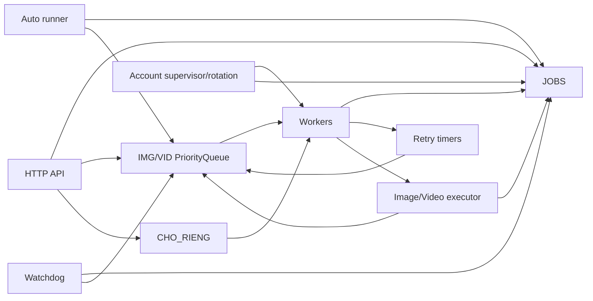
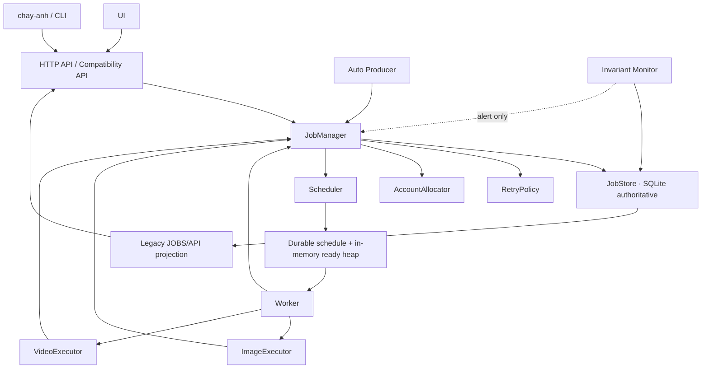
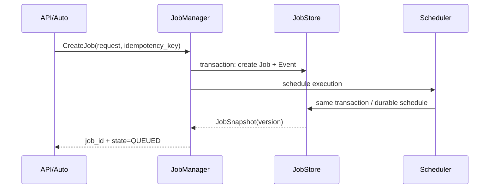
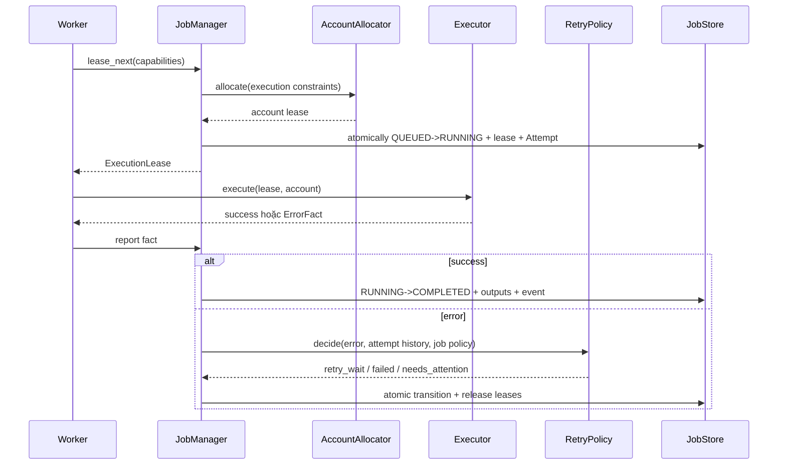

# Kiến trúc đích cho vòng đời job ảnh và video

Trạng thái: **ĐÃ ĐƯỢC NGƯỜI DÙNG PHÊ DUYỆT**
Ngày phê duyệt: 2026-08-14
Căn cứ: `JOB-LIFECYCLE-AUDIT.md` và 29 quyết định đã duyệt trong
`JOB-LIFECYCLE-DECISIONS.md`.

## Mục tiêu

1. Chỉ có một nguồn sự thật cho lifecycle.
2. Mỗi responsibility có đúng một owner.
3. Queue, retry, cancel và account assignment đều thao tác theo identity bền vững,
   không suy từ chuỗi `msg` hoặc tên asset.
4. Có thể migration từng phase, giữ API/UI hiện tại hoạt động.
5. Có thể kiểm thử core lifecycle mà không mở Chrome hoặc tiêu credit.

## Không nằm trong phạm vi thiết kế này

- Không đổi logic DOM của ChatGPT/Grok nếu không cần cho lifecycle event.
- Không đổi format `sf-board.json` hoặc cấu trúc asset/version hiện tại.
- Không đổi thuật toán prompt, ref, ghép ảnh hay tải video.
- Không đưa thêm dịch vụ ngoài; target vẫn là ứng dụng local một process.
- Không tách `sfboard.py` chỉ để làm đẹp trước khi authority đã được di chuyển.

## Kiến trúc hiện tại



`JOBS`, queue, timer, cancel sets và account registry đều có một phần quyền quyết
định lifecycle. Không thành phần nào đủ thông tin để trả lời toàn bộ trạng thái.

## Kiến trúc đích



Mọi mũi tên thay đổi lifecycle đều đi qua `JobManager`. Executor và Worker gửi
facts/results; chúng không tự chọn state tiếp theo.

## Ownership bắt buộc

| Thành phần | Được làm | Bị cấm |
|---|---|---|
| HTTP API | Validate request envelope, gửi command, trả `job_id`/snapshot | Không ghi store, không `queue.put`, không chọn retry/account |
| UI | Hiển thị snapshot server, gửi command; local state `submitting` | Không tự ghi lifecycle `running/done/error` |
| Auto Producer | Phát hiện asset đủ điều kiện, gửi `CreateJob` idempotent | Không revive failed job, không retry, không sửa queue/store |
| JobManager | Authority duy nhất cho command và transition | Không gọi DOM/provider trực tiếp |
| JobStore | Transaction, CAS/version, event/attempt persistence, query | Không chọn policy, không execute, không tự transition |
| Scheduler | Lưu lịch `execution_id`, `not_before`, priority; cấp lease qua JobManager | Không tự quyết state/retry/account |
| RetryPolicy | Từ error class + attempt history trả `RetryDecision` | Không enqueue, không ghi store, không xoay account |
| AccountAllocator | Chọn/cấp account lease theo capability/health/constraint | Không thay job state, không quyết retry |
| Worker | Xin execution lease, gọi executor, báo event/result | Không ghi store/queue, không tự retry hoặc rotate |
| ImageExecutor | Thực hiện một image attempt, phát phase/result/error class | Không biết queue, auto, terminal state |
| VideoExecutor | Thực hiện một video attempt, ghi rõ pre/post submit và credit risk | Không biết queue, auto, terminal state |
| Invariant Monitor | Kiểm tra lease/state/queue và cảnh báo | Không enqueue hoặc sửa lifecycle |
| Legacy Projection | Chiếu JobStore thành schema `JOBS` cho UI cũ | Không là nguồn sự thật, không nhận write |

## Data model đích

### Asset identity

`asset_id` vẫn là id SF hoặc shot từ board. Asset không phải một job và không giữ
retry/cancel state.

### Job

Một yêu cầu tạo một output cho một asset.

Canonical lifecycle states của Job là: `CREATED`, `QUEUED`, `RUNNING`,
`RETRY_WAIT`, `COMPLETED`, `FAILED`, `CANCELLED`, `NEEDS_ATTENTION`. Ý nghĩa và
transition duy nhất hợp lệ được định nghĩa trong `JOB-STATE-MACHINE.md`; module
khác không được tự thêm state.

```text
Job
  job_id                 UUID/ULID
  asset_id               SF/shot id ổn định
  kind                   image | video
  state                  state machine chuẩn
  batch_id               nullable
  copy_index             nullable; multi-copy là các child job
  origin                 manual | auto | cli | compatibility
  rerun_of               nullable job_id
  replace_current        bool
  forced_account_id      nullable
  allow_account_fallback bool
  priority               số thứ tự phim
  version                CAS version
  next_attempt_at        nullable
  last_error_class       nullable
  last_error_message     nullable
  created_at/updated_at/finished_at
  archived_at            nullable
```

Terminal job không đổi state nữa. Explicit rerun tạo Job mới có `rerun_of`.

### Batch

Nhóm ý định từ một thao tác user/auto.

```text
Batch
  batch_id
  kind
  mode                   image_group | multi_copy | bulk_video
  member_job_ids
  requested_by
  created_at
```

- `image_group`: nhiều asset cần gửi chung một tin ChatGPT.
- `multi_copy`: nhiều child job cùng `asset_id`, mỗi child là output độc lập.
- `bulk_video`: nhóm theo thao tác UI; mỗi video vẫn có execution riêng.

### Execution

Đơn vị Scheduler/Worker thực thi. Queue chứa `execution_id`, không chứa asset id.

```text
Execution
  execution_id
  kind
  member_job_ids         một video/copy hoặc nhiều job trong image_group
  state                  ready | leased | waiting | finished
  priority
  not_before
  lease_id/lease_until   nullable
  version
  created_at/updated_at
```

Lifecycle public nằm trên Job; state của Execution chỉ phục vụ scheduling/lease.
Một transaction phải cập nhật execution và các member job liên quan.

### Attempt

Một lần executor thực sự thử một Execution.

```text
Attempt
  attempt_id
  execution_id
  number
  account_id
  lease_id
  phase                  preparing | attaching | ready_to_submit | submitted |
                         waiting_provider | downloading | saving | finished
  started_at/submitted_at/finished_at
  outcome                success | error | cancelled | unknown
  error_class/error_message
  consumes_credit        true | false | unknown
  provider_request_ref   nullable
```

Reconnect trước submit không tạo credit attempt mới. Mỗi provider submit phải có
dấu `submitted_at` bền vững trước khi tiếp tục chờ kết quả.

### JobEvent

Append-only audit trail:

```text
JobEvent
  event_id
  job_id
  attempt_id             nullable
  actor                  api | auto | manager | scheduler | worker | user | recovery
  event_type
  from_state/to_state    nullable cho progress event
  reason_code
  payload_json
  created_at
```

UI cleanup chỉ archive Job; event không bị xóa ngay.

### Account và AccountLease

```text
Account
  account_id
  kind/capabilities      image, video; video trên profile ảnh phải opt-in
  enabled
  health                 healthy | cooldown | unavailable
  cooldown_until
  max_slots

AccountLease
  lease_id
  account_id
  attempt_id
  slot
  acquired_at/expires_at/released_at
```

Một attempt lưu account trước khi executor chạy. Forced account là constraint của
toàn job; không tự mất hiệu lực khi retry.

## SQLite là nguồn sự thật

- Dùng `sqlite3`, WAL mode và foreign keys.
- Transaction/CAS bảo vệ transition, queue schedule, lease và event.
- In-memory heap chỉ là cache các execution `ready`; có thể dựng lại từ DB.
- Không serialize executor object, browser session hoặc thread.
- Mỗi schema change có migration version và backup/rollback procedure.
- `sf-board.json` tiếp tục là nguồn asset/prompt/ref; SQLite chỉ sở hữu lifecycle.

## Interface khái niệm

### JobManager commands

```text
create_job(request, idempotency_key) -> JobSnapshot
create_batch(requests, mode, idempotency_key) -> BatchSnapshot
cancel_job(job_id, reason) -> JobSnapshot
stop_all(mode=safe|emergency) -> StopSummary
rerun_job(old_job_id, overrides) -> JobSnapshot
archive_job(job_id) -> None
resolve_attention(job_id, resolution) -> JobSnapshot
```

### Worker facts

```text
lease_next(worker_capabilities) -> ExecutionLease | None
attempt_phase(lease_id, phase, payload)
attempt_succeeded(lease_id, outputs)
attempt_failed(lease_id, ErrorFact)
attempt_cancelled(lease_id, phase)
heartbeat(lease_id)
```

Mỗi command/fact có idempotency key. Gửi lại cùng event không được tạo transition
hoặc credit attempt thứ hai.

## Luồng tạo job



Validation dependency thất bại trước khi tạo job thì API trả lỗi, không tạo một
`FAILED` giả. Auto chỉ gọi `CreateJob` khi prompt/ref/start-frame đã sẵn sàng.

## Luồng worker và retry



RetryPolicy không gọi Scheduler. JobManager áp decision và tạo lịch `not_before`
trong cùng transaction.

## Cancel và stop

- Cancel `QUEUED/RETRY_WAIT`: transition ngay `CANCELLED`; queue token cũ thành stale.
- Cancel image execution đang chạy: xác nhận dừng cả image group; manager phát
  cancellation token theo job/execution version.
- Cancel video trước submit: executor dừng và báo `CANCELLED`.
- Video sau submit: safe cancel bị từ chối; attempt tiếp tục tải/lưu.
- Safe stop-all: mở stop barrier, chặn producer, cancel queued/retry-wait, request
  interrupt ảnh, để submitted video hoàn tất.
- Emergency stop: user xác nhận nguy cơ; kill browser/account và chuyển attempt có
  outcome không chắc chắn sang `NEEDS_ATTENTION`.

Không dùng cancel set theo asset hoặc generation integer nhập nhằng. Mỗi queue token,
lease và cancel command mang `job_id + expected_version`.

## Account allocation và health

- Lỗi validation/permanent không ảnh hưởng account health.
- Session transient thử reconnect cùng account một lần trước submit.
- Quota/rate-limit đưa account vào cooldown, không toggle `enabled` của user.
- Browser/session fatal mới được đóng/relaunch account.
- Khi cả browser bị mất, mọi sibling lease nhận `ACCOUNT_LOST`; manager xử từng
  attempt qua RetryPolicy.
- Video chỉ dùng profile ảnh có capability `allow_video`.
- Forced account áp dụng mọi attempt; fallback chỉ khi job được tạo với flag rõ.

## Recovery

Khi startup:

1. Load schema và durable schedule.
2. `QUEUED/RETRY_WAIT` được đưa lại vào ready heap theo `not_before`.
3. Lease chưa hết hạn được chờ heartbeat trong grace period ngắn.
4. Lease hết hạn trước submit: RetryPolicy có thể schedule attempt mới.
5. Lease hết hạn sau submit: Job chuyển `NEEDS_ATTENTION`, không submit lại.
6. AccountLease hết hạn được giải phóng transactionally.

Không dùng watchdog để đoán từ UI state. Invariant Monitor báo mọi mismatch giữa
Job, Execution, schedule và lease.

## Compatibility với code hiện tại

Trong migration:

- `/api/jobs` tiếp tục trả `jobs` theo asset id bằng `LegacyJobProjection`.
- Projection chọn active job; nếu không có thì chọn job mới nhất chưa archive.
- Message tiếng Việt được dựng từ state/reason code, không là input của policy.
- Endpoint cũ tiếp tục hoạt động nhưng gọi command mới và có thể trả thêm `job_id`.
- `chay-anh.py` vẫn đọc schema cũ trong các phase đầu; về sau bỏ retry controller
  riêng và chỉ theo dõi terminal result.
- Queue drawer cũ không được đọc trực tiếp SQLite hoặc in-memory heap.

## Ranh giới module dự kiến

Tên chính xác có thể được migration plan điều chỉnh, nhưng ownership phải giữ:

```text
sfboard/jobs/
  models.py             Job, Batch, Execution, Attempt, Event, enums
  store.py              JobStore interface + SQLiteJobStore
  manager.py            commands, transitions, orchestration
  scheduler.py          durable schedule, heap cache, leases
  retry.py              RetryPolicy và ErrorClass
  accounts.py           AccountAllocator, health, AccountLease
  projection.py         schema JOBS/API cũ
  recovery.py           startup recovery

sfboard/executors/
  image.py              adapter quanh logic ảnh hiện có
  video.py              adapter quanh logic video hiện có
```

Không di chuyển logic DOM lớn trong phase đầu. Adapter gọi lại `_generate_lo_ruot`
và `_gen_video` cho tới khi state writes bên trong đã được thay bằng facts.

## Invariants kiến trúc

1. Mọi Job transition đi qua `JobManager` và CAS version.
2. Terminal Job không transition; rerun tạo Job mới.
3. Mỗi active Execution có tối đa một lease hợp lệ.
4. Mỗi Attempt có đúng một account lease và tối đa một `submitted_at`.
5. Queue/schedule chỉ chứa `execution_id`.
6. `RETRY_WAIT` luôn có `next_attempt_at`; `QUEUED` luôn có durable schedule.
7. `RUNNING` luôn có execution lease chưa hết hạn hoặc đang recovery grace.
8. Cancelled job không thể được lease bởi token cũ.
9. UI text không quyết định policy.
10. Watchdog/monitor không mutate lifecycle.
11. Late output chỉ được đè current asset khi Job còn quyền `replace_current` và
    version/intent chưa bị một user mutation mới thay thế.
12. Mọi operation có side effect credit được audit bằng Attempt.

## Tiêu chí chấp nhận kiến trúc

- Có thể giải thích owner của từng write mà không nhắc “ngoại lệ”.
- Có thể test JobManager/Store/Scheduler/RetryPolicy không cần browser.
- Cancel, stop, retry và recovery đều dựa trên job/version/lease, không suy từ asset.
- API/UI cũ có đường compatibility rõ cho migration.
- Không cần big-bang rewrite để đạt target.
