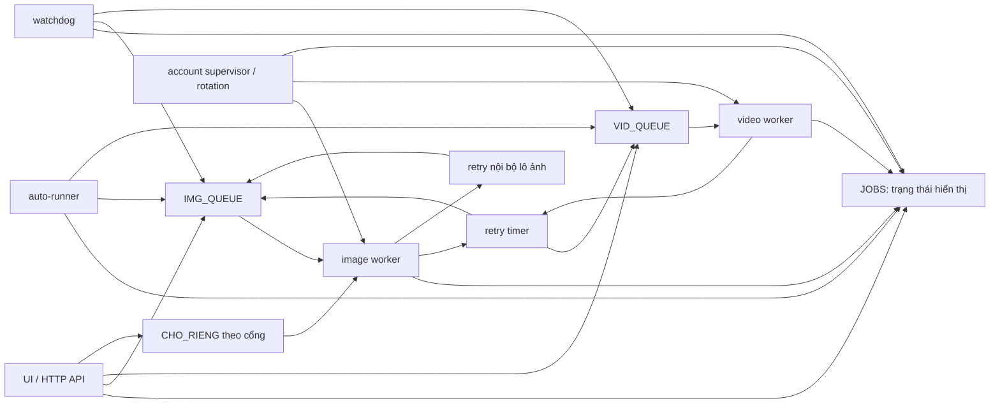
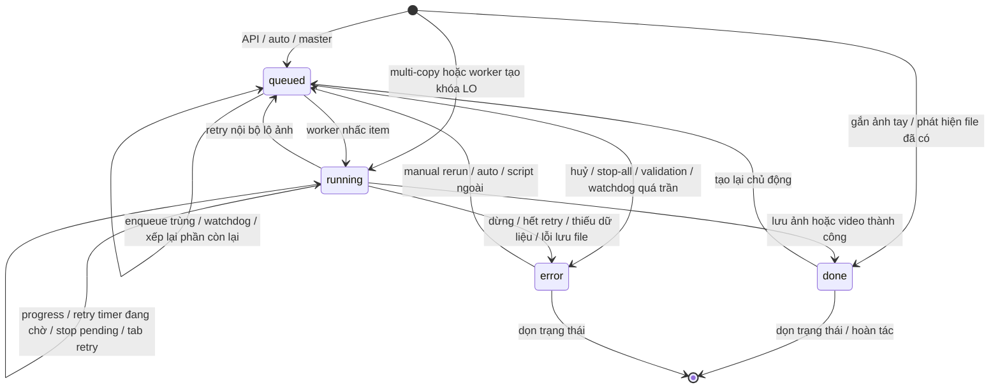

# Audit vòng đời job ảnh và video hiện tại

Ngày chụp: 2026-08-14. Phạm vi: working tree hiện tại của `grokpipe` trên nhánh
`main`. Đây là tài liệu mô tả và đánh giá; không đề xuất thay đổi production trong
đợt này.

## Kết luận ngắn

Hệ thống chưa có một state machine duy nhất. Một “job” hiện được biểu diễn đồng
thời bởi nhiều cấu trúc:

- `JOBS`: dấu vết trạng thái phục vụ UI, không phải hàng đợi thật.
- `IMG_QUEUE` và `VID_QUEUE`: hai `PriorityQueue` chứa việc thật.
- khóa lô `LO:a,b,c` trong queue và đôi lúc trong `JOBS`, trong khi UI chủ yếu đọc
  từng id thành viên `a`, `b`, `c`.
- `CHO_RIENG`: hàng riêng theo cổng tài khoản, nằm ngoài cả hai `PriorityQueue`.
- `DA_HUY`, `DUNG_RIENG`, `GEN`, `TAY_SF`: bốn loại ý định dừng/chạy lại khác nhau.
- `tries` trong tuple queue, `_HOAN`, `AUTO[scene]["try"]`, biến `cuu` của watchdog
  và bộ đếm riêng của `chay-anh.py`: năm không gian retry độc lập.
- `ACCOUNTS`, `DEAD`, `DEAD_DEN`, `WORKERS` và thread-local `_TL`: trạng thái tài
  khoản/worker, không có assignment bền vững trên job.

Vì vậy `JOBS.state` không đủ để suy ra job có thật trong queue hay không, đang nằm
trong timer hay không, đang được worker nào giữ, còn bao nhiêu lần retry, hoặc đã
bị user huỷ chưa. Watchdog `_gac_hang_doi()` tồn tại để suy đoán và sửa chênh lệch
này, nhưng chính nó là một writer/re-enqueuer nữa.

## Thành phần và quyền sở hữu thực tế



Không nút nào trong sơ đồ là owner duy nhất của lifecycle.

## Mô hình dữ liệu hiện tại

### Queue item

Mọi item được chuẩn hóa ở `hangdoi.xep()` thành:

```text
(priority, sequence, (kind, ident, tries, manual))
```

- `kind`: `img` hoặc `vid`.
- `ident`: id shot video, id ảnh lẻ, hoặc chuỗi lô `LO:a,b,c`.
- `tries`: chỉ là số lần retry của worker; không bao gồm retry nội bộ lô ảnh,
  retry của auto, retry tab video hay cứu hộ watchdog.
- `manual`: quyết định ảnh đã có được phép bị tạo lại; không phải nguồn duy nhất,
  vì watchdog còn phục dựng nó từ `TAY_SF`.

Nguồn: `sfboard/hangdoi.py:287-295`, `sfboard/sfboard.py:1445-1446`.

### `JOBS`

Schema công bố là `queued | running | done | error`, nhưng `_Jobs.__setitem__()`
còn tự thêm thời gian, nhãn tài khoản, số lần và lịch sử `VET`. `JOBS` là dict dùng
chung giữa nhiều HTTP thread, worker, supervisor, auto-runner và watchdog mà không
có lock chuyển trạng thái.

Nguồn: `sfboard/hangdoi.py:31-153`.

### Identity kép của ảnh lô

Queue giữ `LO:a,b,c`; `dat_job()` ghi cả khóa `LO:a,b,c` lẫn từng thành viên. Nhưng
các producer ban đầu thường chỉ ghi thành viên, chưa ghi khóa lô. Khóa lô chỉ xuất
hiện khi worker nhấc item và gọi `dat_job()`.

Nguồn: `sfboard/hangdoi.py:332-342`, `sfboard/sfboard.py:1456`,
`sfboard/sfboard.py:1934-1939`, `sfboard/sfboard.py:4017-4035`.

## Lifecycle ảnh hiện tại

### Các producer ban đầu

1. `/api/generate`: ghi từng SF `queued`, đặt `TAY_SF`, rồi xếp một hoặc nhiều item
   cùng ident `LO:<sf>` vào `IMG_QUEUE` (`sfboard.py:3666-3706`). Chỉ chặn state
   `running`, không chặn `queued`.
2. `/api/tao-lo`: nhóm theo địa điểm, ghi từng thành viên `queued`, sau đó xếp
   `LO:a,b,c` vào `IMG_QUEUE` hoặc `CHO_RIENG[port]` (`sfboard.py:3953-4037`). Cũng
   chỉ bỏ thành viên `running`, không bỏ `queued`.
3. `/api/master`: ghi từng ảnh gốc `queued` và xếp từng lô một ảnh
   (`sfboard.py:3879-3906`). Không kiểm tra state hiện có.
4. `_auto_scene`: chọn ảnh chưa có file và không `queued/running`, ghi thành viên
   `queued`, xếp lô vào `IMG_QUEUE` (`sfboard.py:1899-1941`).
5. `chay-anh.py`: client ngoài process gọi lặp `/api/generate`; tự coi job treo sau
   600 giây và có bộ retry tối đa mặc định 25 (`sfboard/chay-anh.py:61-113`).

### Worker và executor

1. Worker cạnh tranh lấy từ `CHO_RIENG` trước, rồi `IMG_QUEUE`.
2. Ngay sau khi lấy, worker gọi `dat_job(...running...)`, tạo/ghi cả khóa lô và
   từng thành viên (`sfboard.py:1429-1459`).
3. `_generate_lo_ruot()` có thể:
   - `running -> done` nếu file đã có và đây là auto job;
   - `running -> error` khi thiếu prompt/ref hoặc master chưa sẵn sàng;
   - tiếp tục ghi `running` khi bắt đầu gửi;
   - `running -> queued` rồi tự `_xep()` lại cả lô nếu lượt về không trọn vẹn;
   - `running -> done/error` cho từng thành viên khi ghép kết quả.
4. Exception thoát ra worker làm worker xoay tài khoản trước, sau đó ghi trạng thái
   “running, thử lại sau…” và tạo `threading.Timer` để xếp lại. Ảnh không có trần
   retry worker (`sfboard.py:1500-1552`).

## Lifecycle video hiện tại

### Các producer ban đầu

1. `/api/genvideo`: kiểm tra `queued/running`, validate prompt/start-frame rồi gọi
   `_enqueue("vid")` (`sfboard.py:4396-4415`).
2. `/api/video-lo`: lọc các shot hợp lệ và chưa `queued/running`, gọi `_enqueue()`
   cho từng shot (`sfboard.py:4416-4455`).
3. Auto-video: chỉ bỏ shot có state `running`; shot vẫn `queued` không bị bỏ. Sau
   cooldown, cùng shot có thể được `_enqueue()` lần nữa (`sfboard.py:1943-1953`).
4. UI còn có đường gọi tuần tự `/api/genvideo` cho một danh sách
   (`sfboard/ui/board.js:1603`).

### Worker và executor

1. Worker lấy `VID_QUEUE`, ghi `running` và gọi `_gen_video()`.
2. `_gen_video()` có một retry nội bộ khi tab chết nhưng endpoint vẫn sống; retry
   này không tăng `tries` của queue (`sfboard.py:2331-2365`).
3. Thành công ghi `done`; dừng riêng trước submit ghi `error`.
4. Exception ngoài cùng xoay tài khoản, rồi:
   - nếu `tries + 1 >= VID_MAX_TRY` thì ghi `error`;
   - nếu chưa tới trần thì giữ state `running`, tạo timer xếp lại.

Lưu ý: `_xoay_chrome()` chạy trước phép kiểm trần, nên ngay cả lần video cuối cùng
đã quyết định dừng vẫn có thể tắt/bật tài khoản (`sfboard.py:1525-1547`).

## Sơ đồ state hiện tại

Sơ đồ này mô tả những gì code thực sự cho phép, không phải state machine mong muốn.



Không có state riêng cho `retry_wait`, `cancel_requested`, `cancelled`, `reserved`,
`dequeued`, `blocked`, `partial_success` hoặc `orphaned`. Các trạng thái đó bị nhét
vào `running`, `queued` hoặc `error` bằng nội dung `msg`.

## Toàn bộ writer của `JOBS`

### Writer trung gian

- `_Jobs.__setitem__`: đóng dấu, dán tài khoản, ghi `VET`
  (`hangdoi.py:52-135`).
- `dat_job`: ghi ident và rải state xuống thành viên lô
  (`hangdoi.py:332-342`).

### Worker/scheduler/executor

- `_worker`: `running`, cancel `error`, retry `running`, video hết retry `error`,
  và xoá khóa lô (`sfboard.py:1456-1552`).
- `_enqueue`: `queued` hoặc `running` cho multi-copy (`sfboard.py:1562-1586`).
- `_batch_tick`: progress `running`, cuối `done/error` (`sfboard.py:1602-1620`).
- `_gac_hang_doi`: orphan quá 12 lần thành `error` (`sfboard.py:1627-1744`).
- `_auto_scene`: thành viên ảnh thành `queued` (`sfboard.py:1934-1939`).
- `_gen_video`: `running`, stop `error`, tab-reopen `running`, success `done`
  (`sfboard.py:2303-2379`).
- `_generate_lo_ruot`: các state validate, chạy, retry, partial, copy lỗi và success
  (`sfboard.py:3003-3249`).
- `_pl_gan`: gắn ảnh từ hộp chờ thành `done` (`sfboard.py:2894`).
- `_ht_lui`: hoàn tác gắn thì `pop` state (`sfboard.py:2969`).

### HTTP API

- `/api/generate`: `queued` (`sfboard.py:3699-3705`).
- `/api/dung-het`: mọi `queued/running -> error`; item vét khỏi queue đi qua
  `dat_job` (`sfboard.py:3707-3736`).
- `/api/huy`: item trong queue và mọi state `queued -> error`
  (`sfboard.py:3761-3790`).
- `/api/xoa-xong`, `/api/xoa-loi`: `pop` state (`sfboard.py:3791-3814`).
- `/api/dung-viec`: giữ `running` nhưng đổi nghĩa thành stop-requested
  (`sfboard.py:3815-3833`).
- `/api/huy-viec`: `error`, `pop` khóa lô, và `queued` cho phần lô còn lại
  (`sfboard.py:3834-3878`).
- `/api/master`: `queued` (`sfboard.py:3879-3906`).
- `/api/tao-lo`: `queued` (`sfboard.py:3953-4035`).
- `/api/acct?op=toggle`: tắt account làm các item `CHO_RIENG` thành `error`
  (`sfboard.py:4352-4361`).
- `/api/genvideo`, `/api/video-lo`: ghi gián tiếp qua `_enqueue`
  (`sfboard.py:4396-4455`).

### Browser UI

`sfboard/ui/board.js` có một biến `JOBS` phía client riêng. Nó ghi optimistic
`running` trước khi server nhận `/api/genvideo` và `/api/generate`, rồi xóa local
khi dọn/xóa ảnh (`board.js:437-496`, `board.js:1814-1815`,
`board.js:2423-2439`). Đây không phải cùng dict Python, nhưng tạo thêm một nguồn
state tạm thời mà UI hiển thị trước khi poll server.

## Toàn bộ writer của `PriorityQueue`

Writer vật lý duy nhất là `hangdoi.xep() -> Q.put()` (`hangdoi.py:287-290`). Các
caller có quyền tạo hoặc tái tạo item là:

1. `_enqueue`: producer chung, hiện chủ yếu dùng cho video (`sfboard.py:1562-1586`).
2. `/api/generate`: ảnh một/nhiều bản (`sfboard.py:3698-3705`).
3. `/api/master`: ảnh gốc địa điểm (`sfboard.py:3901-3904`).
4. `/api/tao-lo`: lô ảnh user chọn (`sfboard.py:4017-4035`).
5. `_auto_scene`: ảnh auto (`sfboard.py:1934-1939`).
6. `_xep_lai_sau._ban`: retry timer của worker (`sfboard.py:1382-1402`).
7. `_generate_lo_ruot`: retry nguyên task ảnh không trọn vẹn
   (`sfboard.py:3149-3183`).
8. `_gac_hang_doi`: cứu orphan ảnh/video (`sfboard.py:1627-1744`).
9. `/api/huy-viec`: xé lô và xếp phần còn lại (`sfboard.py:3834-3877`).

`CHO_RIENG` là queue thứ ba không dùng `PriorityQueue`: `/api/tao-lo` append ident
theo port, worker ảnh pop đầu danh sách, API account/cancel có thể pop/lọc nó
(`sfboard.py:1433-1438`, `sfboard.py:4029-4033`, `sfboard.py:4352-4361`,
`sfboard.py:3867-3869`).

Consumer/drainer:

- Worker dùng `hangdoi.lay()` (`sfboard.py:1440-1444`).
- `/api/dung-het` và `/api/huy` gọi `get_nowait()` trực tiếp trên cả hai queue
  (`sfboard.py:3716-3723`, `sfboard.py:3768-3776`).
- `vet_hang()` hiện chỉ được import, không có caller production.

## Writer của retry state

| Không gian retry | Writer | Reset | Chính sách |
|---|---|---|---|
| `item[2] = tries` | `_worker` khi tạo timer | producer mới luôn đặt 0 | ảnh vô hạn; video tối đa `VID_MAX_TRY=5` |
| `_HOAN["GR:LO:..."]` | `_generate_lo_ruot` | một số nhánh success/error | retry nguyên task ảnh tối đa `LO_THU_LAI=2` |
| `AUTO[scene]["try"]` và `last` | `_auto_allow` | tắt/bật auto tạo dict mới | mặc định vô hạn, cooldown 6 vòng |
| `cuu` local của watchdog | `_gac_hang_doi` | restart process hoặc `GEN` đổi | cứu orphan tối đa 12 |
| vòng `attempt in range(2)` | `_gen_video` | mỗi lần worker gọi | mở lại session một lần |
| `thu`, `lan_loi`, `bat_dau` | `chay-anh.py` | restart script | mặc định 25, treo 600s |
| `JOBS[*].lan` | `_Jobs._dong_dau` | mất khi `JOBS.pop` | chỉ tăng khi state đổi sang `running` |

`JOBS[*].lan` không đếm đúng retry worker: worker ghi `running` trong lúc state đã
là `running` suốt thời gian timer chờ, nên lần chạy kế tiếp không tăng `lan`.

Ngoài ra `_generate_lo_ruot` dùng counter key `GR:LO:...` nhưng một số reset gọi
`_HOAN.pop("LO:...")`, thiếu tiền tố `GR:` (`sfboard.py:3059`, `3069`, so với
`3149-3175`). Counter cũ có thể sống qua lần chạy sau cho tới khi chạm nhánh reset
đúng.

## Writer của account state và cơ chế assignment

### Registry/account availability writers

- `_init_accounts`: nạp hoặc tạo toàn bộ `ACCOUNTS` (`sfboard.py:450-475`).
- `_giu_du_tai_khoan`: tắt account vượt trần (`sfboard.py:1184-1219`).
- `_xoay_chrome`: tắt account lỗi, bật account kế tiếp, ghi `auto_off`, `DEAD` và
  `DEAD_DEN` (`sfboard.py:1283-1378`).
- `_supervisor`: gỡ dead state và sinh worker theo account/tab
  (`sfboard.py:1747-1807`).
- `/api/acct`: add, rename, đổi tabs, toggle, revive, delete
  (`sfboard.py:4295-4394`).
- `/api/so-tk`: đổi trần và gọi `_giu_du_tai_khoan`
  (`sfboard.py:4283-4294`).

### Assignment job -> account

Không có field assignment bền vững. Assignment mặc định xảy ra bằng cạnh tranh:
supervisor tạo worker gắn cứng với endpoint; worker nào lấy được item trước thì
account đó nhận job. `_TL.endpoint` chỉ tồn tại trong thread worker
(`sfboard.py:1414-1446`). `_Jobs` chỉ đóng dấu account sau khi state được ghi; đó
là quan sát sau assignment, không phải nguồn assignment.

Ngoại lệ là `/api/tao-lo?tk=<port>` ghi ident vào `CHO_RIENG[port]`. Nhưng nếu lần
đó lỗi, `_worker` đưa retry vào `IMG_QUEUE` chung, nên “ép tài khoản” không còn
được giữ ở lần retry (`sfboard.py:4029-4035`, `sfboard.py:1549-1552`).

Khi không có account video đang bật, `_pool("vid")` dùng account ảnh và supervisor
tạo thêm video worker trên các account ảnh (`sfboard.py:478-495`,
`sfboard.py:1762-1795`).

## Mọi cơ chế có thể re-enqueue cùng một logical job

1. Retry timer của worker sau mọi exception chưa terminal.
2. Retry nguyên task của `_generate_lo_ruot` khi ảnh về thiếu/thừa/0/kèm chữ.
3. Auto-runner quét lại file còn thiếu sau cooldown.
4. Watchdog thấy `JOBS=queued` nhưng không thấy ident trong queue/worker shadow.
5. `/api/huy-viec` huỷ lô cũ rồi xếp phần còn lại thành ident mới.
6. User bấm lại `/api/generate`, `/api/tao-lo`, `/api/master`, `/api/genvideo` hoặc
   `/api/video-lo?lai=1`.
7. `chay-anh.py` tự gọi lại `/api/generate` khi error hoặc khi tự coi job treo.
8. UI có các thao tác tạo lại cả scene/phim, cuối cùng gọi cùng các endpoint trên.
9. Multi-copy `/api/generate?n>1` cố ý xếp nhiều item có cùng ident.

## Transition bất hợp lệ hoặc mơ hồ

### P0 — huỷ một ảnh `queued` có thể không huỷ item thật

Producer ghi state cho từng SF nhưng queue chứa `LO:a,b,c`; trước khi worker nhấc,
`JOBS` thường chưa có khóa `LO:a,b,c`. `/api/huy-viec` lại tìm lô bằng cách quét
các khóa `LO:` trong `JOBS`. Kết quả có thể là `bo=[]`: member bị ghi `error`, nhưng
item lô vẫn nằm trong `IMG_QUEUE`, không có `DA_HUY` cho ident thật. Worker nhấc lô
sau đó và ghi ngược thành `running`.

Nguồn: producer `sfboard.py:1934-1939`, `3698-3705`, `4017-4035`; cancel
`sfboard.py:3856-3877`; worker `sfboard.py:1456-1478`.

### P0 — auto-video có thể tạo duplicate cho job vẫn `queued`

> **ĐÃ SỬA Ở PHASE 3 (2026-08-16).** Auto video chặn cả `queued` và
> `running`, và ý định của auto mang key ổn định theo scope nên vòng quét
> sau chỉ replay. Regression: `test_auto_video_blocks_both_running_and_queued`
> và `test_auto_video_failed_intent_is_not_revived_by_next_scan`.

Ảnh auto chặn cả `queued` và `running`; video auto chỉ chặn `running`. Nếu backlog
video dài hơn cooldown, cùng shot vẫn `queued` sẽ được `_enqueue` lại. Nhiều worker
có thể dựng cùng video và tiêu credit lặp.

Nguồn: `sfboard.py:1909-1911` so với `sfboard.py:1943-1953`.

### P0 — stop-all đua với auto-runner

Auto-runner lấy `st` dưới lock rồi thả lock trước `_auto_scene`. `/api/dung-het`
gọi `AUTO.clear()` không dùng `AUTO_LOCK`. Một vòng auto đã lấy `st` có thể tiếp
tục ghi `queued` và `_xep()` sau khi stop-all vừa vét queue. Item mới chụp generation
sau stop nên có thể chạy bình thường, trái ý user.

Nguồn: `sfboard.py:1958-1984`, `sfboard.py:3707-3736`.

### P1 — retry wait mang state `running`

Sau exception worker đã dừng và item chưa nằm trong queue cho tới khi timer bắn,
nhưng state vẫn là `running`. Vì thế:

- UI đếm một worker bận dù không worker nào giữ job;
- `/api/huy-viec` từ chối huỷ vì tưởng đang chạy;
- `/api/huy` không bắt được timer;
- `JOBS.lan` không tăng khi job thực sự chạy lại.

Nguồn: `sfboard.py:1549-1552`, `sfboard.py:1382-1402`.

### P1 — enqueue trùng không bị chặn thống nhất

- `/api/generate` chỉ chặn `running`, không chặn `queued`.
- `/api/tao-lo` chỉ bỏ member `running`, không bỏ `queued`.
- `/api/master` không kiểm state.
- auto ảnh chặn cả hai.
- hai endpoint video tay chặn cả hai, nhưng auto-video không chặn `queued`.

Không có uniqueness constraint theo logical job/run. Một terminal state có thể bị
duplicate đến sau ghi ngược thành `running` hoặc `error`.

### P1 — lỗi dữ liệu vừa `error` vừa quay lại `running`

`_generate_lo_ruot` ghi `error` rồi raise; catch ngoài `_worker` xử mọi exception,
xoay account, ghi `running` và hẹn retry. `_loi_du_lieu()` chỉ thêm cảnh báo vào
message, không thay policy cho ảnh. Đây là transition `running -> error -> running`
trong một lần gọi, dù dữ liệu không đổi.

Nguồn: `sfboard.py:3036-3039`, `3051-3061`, `1500-1552`.

### P1 — identity/state của multi-copy không biểu diễn được concurrency

> **ĐÃ SỬA MỘT NỬA Ở PHASE 3 (2026-08-16).** `/api/generate?n>1` tạo một
> Batch và N child Job có `job_id`/`copy_index` riêng. Phần chiếu ngược ra
> nhãn legacy vẫn dùng chung khóa SF cho tới khi UI đọc structured state
> (Phase 12). Regression: `test_multi_copy_enqueue_uses_distinct_job_identity_per_copy`.

`/api/generate?n>1` xếp nhiều item cùng `LO:<sf>` nhưng không dùng `BATCH`; tất cả
worker ghi lên cùng khóa SF/lô. State cuối phụ thuộc lần ghi sau cùng, không biểu
diễn được “2 thành công, 1 lỗi, 1 đang chạy”. `_enqueue(copies>1)` có `BATCH`, nhưng
đường ảnh hiện tại không gọi nó.

Nguồn: `sfboard.py:1562-1620`, `sfboard.py:3698-3705`.

### P1 — retry counter không cùng nghĩa và có reset sai key

Worker retry, retry lô, auto retry, tab retry, watchdog retry và script retry đều
đếm khác nhau. UI field `lan` không tương ứng với bất kỳ tổng nào. `_HOAN` còn có
nhánh reset sai namespace như mô tả phía trên.

### P1 — account assignment quan sát sau, không phải state của job

Queued job có thể giữ `tk` cũ vì `_Jobs._dong_dau` kế thừa nhãn từ state trước.
Forced account chỉ sống trong `CHO_RIENG` ở lần đầu. Retry quay về queue chung.
Một lỗi trên một tab làm `_xoay_chrome` đóng cả cửa sổ/account, ảnh hưởng các job
khác trên những tab cùng account.

### P2 — terminal `error` gộp nhiều nghĩa

`error` hiện gồm validation error, exhausted retry, cancelled, stopped, partial
success, account bị tắt, orphan quá trần và lỗi copy file. UI phải suy ý nghĩa từ
chuỗi `msg`; policy retry cũng phải suy lại từ nơi phát sinh thay vì state/type.

### P2 — state không bền qua restart

Queue, `JOBS`, timer, retry counter, cancel flag và assignment đều ở RAM. Restart
process xóa toàn bộ lifecycle; chỉ file ảnh/video và board JSON còn lại. Auto hoặc
script ngoài có thể suy lại “còn thiếu” và tạo run mới, nhưng không có recovery
đúng nghĩa.

## Trách nhiệm bị trùng

| Trách nhiệm | Các owner hiện tại |
|---|---|
| Quyết định enqueue | HTTP API, UI workflow, auto-runner, external script, watchdog, worker retry, executor retry |
| Ghi state | API, worker, image executor, video executor, watchdog, batch tracker, account API, UI optimistic state |
| Retry policy | worker, image executor, video executor, auto-runner, watchdog, `chay-anh.py` |
| Cancel/stop | queue drain, `DA_HUY`, `DUNG_RIENG`, generation `GEN`, browser stop button, kill Chrome |
| Phân loại job ảnh/video | queue được chọn, tuple `kind`, prefix `LO:`, tra shot id trong board, UI prefix `V-` |
| Assignment account | worker competition, `CHO_RIENG`, account rotation, video fallback, account toggle/supervisor |
| Xác định “đang chạy” | `JOBS.state`, queue membership, `CHO_RIENG`, `BAN`, worker registry, UI optimistic state |
| Đếm attempt | queue `tries`, `_HOAN`, `AUTO.try`, watchdog `cuu`, video inner attempt, external script, `JOBS.lan` |

## Invariants cần được chốt trước khi refactor

Đây là các luật hệ thống cần có; một số hiện đang bị vi phạm hoặc chưa có quyết
định rõ ràng.

1. Mỗi execution phải có `job_id/run_id` bất biến; logical asset id không được dùng
   thay run id.
2. Mỗi job chỉ có đúng một authoritative record; queue chỉ tham chiếu job id.
3. Mỗi transition phải atomic, có `from`, `to`, reason, timestamp và actor.
4. Không job terminal nào được quay lại non-terminal nếu không tạo run mới.
5. `queued` nghĩa là có đúng một queue/reservation entry; `running` nghĩa là có
   đúng một worker lease; retry chờ phải là state riêng.
6. Cancel phải thắng mọi producer/retry cũ của cùng run, kể cả timer, watchdog và
   auto đã lấy snapshot trước đó.
7. Enqueue phải idempotent theo run; duplicate chỉ hợp lệ khi được biểu diễn thành
   các child-attempt riêng của một batch.
8. Một lô ảnh và các thành viên phải chuyển trạng thái nhất quán trong cùng một
   transaction/critical section.
9. Retry count phải đơn điệu và có một định nghĩa: attempt nào tốn credit, attempt
   nào chỉ reconnect, và attempt nào là rescue queue.
10. Error class phải quyết định policy: retry cùng account, đổi account, không
    retry, hay terminal; không suy từ text.
11. Account assignment phải là dữ liệu trên attempt; forced assignment và policy
    sau failure phải được định nghĩa rõ.
12. Một lỗi tab không được âm thầm thay đổi lifecycle của các job sibling mà không
    ghi sự kiện cho từng job bị ảnh hưởng.
13. UI chỉ hiển thị server state có version, hoặc optimistic state phải có request
    id và rollback rõ ràng.
14. Restart policy phải rõ: recover pending jobs, hay huỷ toàn bộ run cũ và tạo run
    mới có audit trail.

## Regression tests cần có trước refactor

### Queue và uniqueness

1. Gọi `/api/generate` hai lần khi SF còn `queued`: chỉ có một logical run.
2. `/api/tao-lo` có member đã `queued`: không tạo lô trùng.
3. `/api/master` hai lần: không tạo duplicate.
4. Auto-video qua nhiều cooldown khi item vẫn queued: queue vẫn chỉ có một item.
5. Multi-copy N bản: có N child attempts, progress và terminal aggregate chính xác.
6. Hai worker không thể nhận cùng một run nếu không phải multi-copy có chủ ý.

### Cancel và stop

7. Huỷ một member của lô ảnh queued: item lô cũ không bao giờ chạy; phần còn lại
   được xếp đúng một lần.
8. Huỷ video queued trước và sau nhịp worker dequeue.
9. Huỷ trong retry timer: timer không được enqueue.
10. Dừng riêng trong retry wait: không enqueue rồi mới dừng.
11. Stop-all đua với worker timer: không item nào xuất hiện sau stop.
12. Stop-all đua với `_generate_lo_ruot` internal retry: không requeue.
13. Stop-all/off-auto đua với `_auto_scene`: không enqueue sau khi user dừng.
14. Watchdog không cứu job cancelled/stopped.
15. Explicit rerun xóa đúng cancel token của run cũ mà không xóa cancel của run
    khác có cùng asset id.

### Retry policy

16. Image worker backoff tăng đúng và attempt count đơn điệu.
17. Video dừng chính xác ở `VID_MAX_TRY`, không reset bởi watchdog/auto.
18. Retry tab video không tính như một credit attempt nếu chưa submit.
19. Retry lô ảnh dừng ở `LO_THU_LAI`, reset đúng key giữa hai run.
20. Validation/data error đi đúng policy đã chốt; không đổi account vô hạn ngoài ý
    muốn.
21. Partial image result được biểu diễn và ghép đúng; member thiếu không làm state
    của member thành công regress.
22. User manual rerun sau terminal tạo run mới với counter mới.

### Account assignment

23. Queue chung phân công đúng loại account; video fallback chỉ khi policy cho phép.
24. Forced account chạy trên đúng port; test riêng policy retry sau khi forced run
    lỗi.
25. Một tab lỗi khi account có nhiều tab: mọi sibling bị ảnh hưởng đều nhận state/
    event đúng, không mất job.
26. Hai account lỗi đồng thời không cùng bật/tắt sai account kế tiếp.
27. Video terminal ở lần cuối không xoay account nếu policy không yêu cầu.
28. `tk` của queued run mới không kế thừa account từ run cũ.

### State machine và concurrency

29. Bảng transition từ mọi state: transition bất hợp lệ bị từ chối.
30. Terminal state không regress do duplicate đến muộn.
31. Lô và member chuyển state atomically.
32. Poll `/api/jobs` đồng thời với nhiều writer không lỗi và trả snapshot nhất quán.
33. Event/attempt history giữ đúng thứ tự khi hai worker cập nhật đồng thời.
34. Restart giữa queued, running và retry-wait tuân theo policy recovery đã chốt.

### UI và integration

35. Backend từ chối enqueue thì optimistic state của UI rollback ngay.
36. Queue drawer hiển thị riêng queued/running/retry-wait/cancel-requested/terminal.
37. Cancel qua UI xác nhận bằng queue/server state, không chỉ đổi local `JOBS`.
38. Test end-to-end ảnh: enqueue -> run -> partial retry -> done.
39. Test end-to-end video: enqueue -> run -> transient retry -> done và exhausted
    retry -> terminal.
40. Test `chay-anh.py` không tạo thêm retry layer trái policy server.

## Ranh giới audit

- Không sửa production code.
- Không chạy Chrome, không submit ảnh/video, không tiêu credit.
- Đã xác minh cú pháp hiện tại bằng `python3 -m py_compile` cho
  `sfboard/hangdoi.py` và `sfboard/sfboard.py`.
- Repo hiện không có test suite tự động được phát hiện; `test_check.py`,
  `test_check2.py`, `test_check3.py` đang bị xóa trong working tree.
- `hangdoi.py`, `sfboard.py` và UI đang có thay đổi chưa commit; báo cáo này mô tả
  đúng working tree đó, không phải chỉ `HEAD`.
