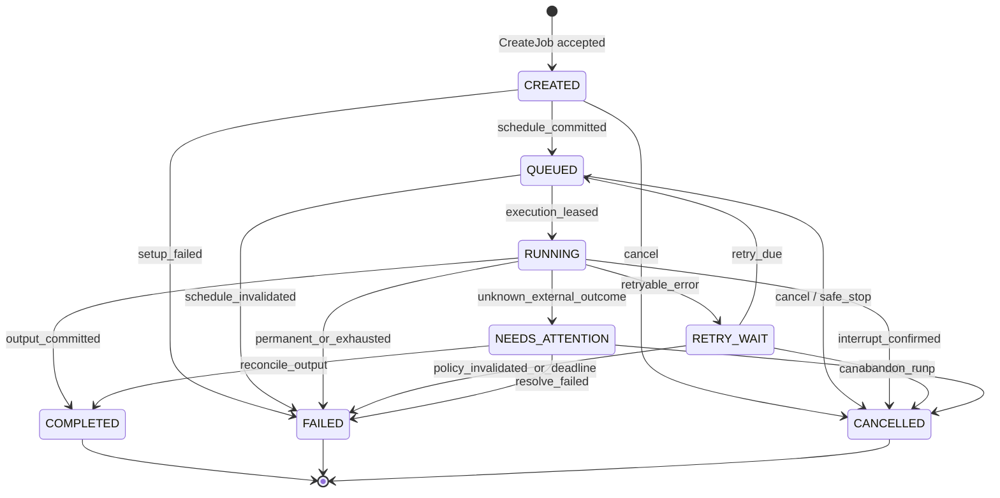

# State machine chuẩn cho job ảnh và video

Trạng thái: **ĐÃ ĐƯỢC NGƯỜI DÙNG PHÊ DUYỆT**
Ngày phê duyệt: 2026-08-14
Áp dụng cho mỗi `Job`; `Execution` và `Attempt` có state nội bộ riêng như mô tả
trong `JOB-ARCHITECTURE-TARGET.md`.

## Quy ước

- Transition chỉ được thực hiện bởi `JobManager` qua CAS `expected_version`.
- Progress event không phải state transition.
- Terminal state là bất biến.
- Explicit rerun luôn tạo `job_id` mới.
- Validation request envelope/dependency xảy ra trước khi tạo Job. Nếu request bị
  từ chối thì không có một Job `FAILED` giả.

## Các state

| State | Ý nghĩa bắt buộc | Dữ liệu bắt buộc |
|---|---|---|
| `CREATED` | Job đã được chấp nhận nhưng chưa có durable schedule | `job_id`, `asset_id`, `kind`, `version` |
| `QUEUED` | Có đúng một durable execution schedule sẵn sàng hoặc chờ `not_before <= now` | `execution_id`, `priority`, schedule version |
| `RUNNING` | Execution đang có lease hợp lệ và ít nhất một Attempt active | `execution_id`, `attempt_id`, `lease_id`, `account_id` |
| `RETRY_WAIT` | RetryPolicy đã cho retry nhưng chưa đến hạn | `next_attempt_at`, `last_error_class` |
| `COMPLETED` | Output hợp lệ đã được lưu; terminal | output/version metadata, `finished_at` |
| `FAILED` | Không retry tiếp theo policy hoặc lỗi permanent; terminal | error class/reason, `finished_at` |
| `CANCELLED` | User/system đã huỷ run này; terminal | cancel actor/reason, `finished_at` |
| `NEEDS_ATTENTION` | Có khả năng provider side effect đã xảy ra nhưng outcome không chắc chắn; không tự retry | attempt/phase/account/provider refs |

`NEEDS_ATTENTION` không phải terminal kỹ thuật vì user có thể reconcile nó, nhưng
Scheduler tuyệt đối không lease state này.

## Sơ đồ đầy đủ



## Bảng transition hợp lệ

| # | From | Event/command | Actor | Điều kiện | To | Side effects atomic |
|---|---|---|---|---|---|---|
| T01 | — | `CreateJob` | API/Auto/CLI qua Manager | request hợp lệ, idempotency chưa tồn tại | `CREATED` | insert Job + created Event |
| T02 | `CREATED` | `ScheduleCommitted` | Manager | execution và schedule tạo được | `QUEUED` | insert Execution/schedule + event |
| T03 | `CREATED` | `SetupFailed` | Manager | không thể tạo execution/store invariant | `FAILED` | error + terminal event |
| T04 | `CREATED` | `CancelJob` | User/System | version khớp | `CANCELLED` | cancel event |
| T05 | `QUEUED` | `ExecutionLeased` | Manager theo yêu cầu Worker | schedule due, capability/account hợp lệ, chưa stop barrier | `RUNNING` | lease execution/account + create Attempt + remove ready token |
| T06 | `QUEUED` | `CancelJob` | User/System | version khớp | `CANCELLED` | invalidate schedule/token + event |
| T07 | `QUEUED` | `ScheduleInvalidated` | Recovery/Admin | execution không còn chạy hợp lệ và không thể rebuild | `FAILED` | remove schedule + error event |
| T08 | `RUNNING` | `AttemptSucceeded` | Worker báo fact | lease hợp lệ, outputs commit thành công | `COMPLETED` | outputs + finish attempt + release leases + event |
| T09 | `RUNNING` | `AttemptFailed` + retry decision | Manager/RetryPolicy | error retryable, còn budget, outcome chắc chắn | `RETRY_WAIT` | finish attempt + `next_attempt_at` + release leases + event |
| T10 | `RUNNING` | `AttemptFailed` + terminal decision | Manager/RetryPolicy | permanent, validation hoặc exhausted | `FAILED` | finish attempt + release leases + terminal event |
| T11 | `RUNNING` | `InterruptConfirmed` | Executor/Worker | provider chưa submit hoặc image execution đã dừng chắc chắn | `CANCELLED` | finish attempt + release leases + event |
| T12 | `RUNNING` | `OutcomeUnknown` | Recovery/Worker | đã/có thể submit nhưng không xác minh kết quả | `NEEDS_ATTENTION` | finish/expire lease + attention event |
| T13 | `RETRY_WAIT` | `RetryDue` | Scheduler qua Manager | due, chưa cancelled, policy/version còn hợp lệ | `QUEUED` | durable schedule + event |
| T14 | `RETRY_WAIT` | `CancelJob` | User/System | version khớp | `CANCELLED` | clear retry schedule + event |
| T15 | `RETRY_WAIT` | `PolicyInvalidated` | Manager/Admin | deadline/budget/config mới cấm retry | `FAILED` | clear schedule + terminal event |
| T16 | `NEEDS_ATTENTION` | `ReconcileOutput` | User/Recovery | xác minh output tồn tại và commit được | `COMPLETED` | output metadata + terminal event |
| T17 | `NEEDS_ATTENTION` | `ResolveFailed` | User/Recovery | xác minh không có output hoặc chọn kết thúc lỗi | `FAILED` | terminal reason + event |
| T18 | `NEEDS_ATTENTION` | `AbandonRun` | User | chấp nhận bỏ outcome cũ | `CANCELLED` | terminal event; không xóa provider output |

## Transition bị cấm

| Transition | Lý do |
|---|---|
| `COMPLETED -> *` | Terminal; tạo lại phải tạo Job mới |
| `FAILED -> *` | Terminal; manual rerun tạo Job mới |
| `CANCELLED -> *` | Terminal; token cũ không được hồi sinh |
| `RUNNING -> RUNNING` | Progress là event; retry phải qua `RETRY_WAIT`/Attempt mới |
| `QUEUED -> QUEUED` | Duplicate enqueue; cập nhật message/priority là event/update cùng version, không transition |
| `RETRY_WAIT -> RUNNING` | Phải qua durable `QUEUED` và lease mới |
| `CREATED -> RUNNING` | Không được bỏ qua schedule/lease transaction |
| `QUEUED -> COMPLETED` | Không có Attempt/output commit hợp lệ |
| `RETRY_WAIT -> COMPLETED` | Không có active Attempt |
| `NEEDS_ATTENTION -> QUEUED/RUNNING` | Không tự retry outcome không chắc chắn; rerun là Job mới |
| Bất kỳ state nào đổi chỉ vì `msg` | Text không phải policy input |

CAS không khớp hoặc transition ngoài bảng phải trả lỗi typed, ghi invariant metric,
và không thực hiện side effect một phần.

## Progress events trong `RUNNING`

Các phase sau không làm `RUNNING -> RUNNING`; chúng chỉ append Attempt/JobEvent:

```text
PREPARING
ATTACHING
READY_TO_SUBMIT
SUBMITTED
WAITING_PROVIDER
DOWNLOADING
SAVING
```

`SUBMITTED` là ranh giới quan trọng:

- trước nó: retry/reconnect thường không tiêu credit;
- sau nó: `consumes_credit=true|unknown`; mất kết nối có thể thành
  `NEEDS_ATTENTION`, không tự submit lại.

## Retry semantics

### Một authority

Chỉ `RetryPolicy.decide(ErrorFact, AttemptHistory, JobPolicy)` trả:

```text
NO_RETRY(error_class, reason)
RETRY(after, account_action, budget_cost)
NEEDS_ATTENTION(reason)
```

JobManager áp decision. RetryPolicy không ghi store và không enqueue.

### Budget

- Ảnh: mặc định tối đa 8 provider-submit attempts cho một Job/Execution policy.
- Lô ảnh không trọn vẹn: tối đa 2 lần gửi lại toàn execution theo D10; đây nằm
  trong cùng attempt budget đã submit, không có counter riêng ngoài JobStore.
- Video: tối đa 5 provider-submit attempts.
- Reconnect trước submit một lần trên cùng account không tiêu submit budget.
- Watchdog, auto và CLI không có retry counter riêng.
- Manual rerun tạo Job mới và budget mới; `rerun_of` giữ audit chain.

### Error class

| Error class | Transition | Account action |
|---|---|---|
| `VALIDATION` | `RUNNING/CREATED -> FAILED` | Không đổi account |
| `CANCELLED` | `RUNNING -> CANCELLED` khi interrupt được | Không đổi account |
| `SESSION_TRANSIENT` trước submit | `RUNNING -> RETRY_WAIT` nếu reconnect thất bại | Same account một lần, rồi allocator chọn lại |
| `PROVIDER_TRANSIENT` outcome chắc chắn | `RUNNING -> RETRY_WAIT` | Policy có thể exclude account vừa lỗi |
| `QUOTA/RATE_LIMIT` | `RUNNING -> RETRY_WAIT` nếu còn budget | Account cooldown, không toggle user-enabled |
| `PERMANENT` | `RUNNING -> FAILED` | Không rotate |
| `UNKNOWN_OUTCOME` | `RUNNING -> NEEDS_ATTENTION` | Giải phóng/cách ly lease; không retry |

Backoff nằm trong `next_attempt_at`; không tạo `threading.Timer` per job.

## Cancel semantics

### Queued và retry wait

- Manager transition atomically sang `CANCELLED`.
- Durable schedule bị invalidated trong cùng transaction.
- Heap token đến muộn chứa version cũ và không lease được.

### Image execution đang chạy

- Một provider message có thể chứa nhiều member Job.
- Cancel một member khi execution đang chạy phải hiển thị xác nhận “dừng cả lô”.
- Khi user xác nhận, cancellation token áp cho Execution; tất cả member chưa
  terminal chuyển `CANCELLED` sau `InterruptConfirmed`.
- Output đến muộn chỉ lưu vào attempt artifacts/history, không đè current asset.

### Video đang chạy

- Trước `SUBMITTED`: cancel được và chuyển `CANCELLED`.
- Từ `SUBMITTED` trở đi: safe cancel bị từ chối; state giữ `RUNNING` cho tới khi lưu
  xong hoặc outcome thành unknown.
- Emergency stop có thể cắt browser, nhưng attempt chuyển `NEEDS_ATTENTION`, không
  báo giả là `CANCELLED` chắc chắn.

## Stop-all semantics

### Safe stop mặc định

1. Manager tạo `StopBarrier` version mới trong store.
2. API/Auto/CLI producer mới bị từ chối hoặc giữ ở trạng thái UI `submitting` thất bại.
3. `QUEUED/RETRY_WAIT/CREATED` chuyển `CANCELLED` transactionally.
4. Image executions active nhận cancellation token.
5. Video trước submit bị cancel; video sau submit chạy nốt và lưu.
6. Stop chỉ hoàn tất khi không còn execution interruptible hoặc đang chờ safe finish.

### Emergency stop

1. User phải xác nhận nguy cơ mất credit/kết quả.
2. Browser/account có thể bị kill.
3. Attempt sau submit không có outcome chuyển `NEEDS_ATTENTION`.
4. Không queue/retry nào được tạo sau barrier từ snapshot/event cũ.

## Account rotation semantics

- Account được gán cho Attempt, không gán ngầm theo thread thắng queue.
- Validation/permanent/job-data error không rotate account.
- Session fatal có thể relaunch/cooldown account.
- Quota/rate-limit cooldown account; allocator chọn account khác nếu Job cho phép.
- Forced account áp dụng mọi retry; không fallback trừ khi Job có
  `allow_account_fallback=true`.
- Một tab/job lỗi không tự đóng cả browser. Browser chỉ đóng khi health classifier
  xác nhận lỗi toàn session/browser.
- Nếu browser chết, mọi sibling Attempt nhận fact `ACCOUNT_LOST` riêng và đi qua
  RetryPolicy; không có state mutation hàng loạt không audit.

## Batch semantics

### Image group

- Manager tạo nhiều Job và một Execution chứa member list cố định/versioned.
- `ExecutionLeased` chuyển tất cả member `QUEUED -> RUNNING` trong một transaction.
- Trong các attempt không trọn vẹn, output đều được lưu làm artifacts.
- Khi execution kết thúc, mỗi member nhận `COMPLETED`, `FAILED`, `CANCELLED` hoặc
  `NEEDS_ATTENTION` theo kết quả của chính nó.
- Member `COMPLETED` không được quay lại `RUNNING` vì retry đến muộn.

### Multi-copy

- Mỗi copy là một child Job cùng `asset_id`, có `copy_index` khác nhau.
- Mỗi child có Execution/Attempt/account/state riêng.
- Batch progress là projection, không phải một state ghi đè child.

### Bulk video

- Batch chỉ nhóm thao tác UI/audit.
- Mỗi video Job có Execution riêng vì mỗi submit độc lập và tiêu credit riêng.

## Auto semantics

- Auto chỉ là producer.
- Auto gọi `CreateJob` idempotent khi asset đủ prompt/ref/start-frame và không có
  active/failed-unacknowledged Job.
- Auto không retry và không tạo Job mới sau `FAILED/CANCELLED/NEEDS_ATTENTION`.
- User acknowledge/manual rerun mới tạo Job mới.
- Auto off/stop barrier được kiểm tra trong transaction tạo Job, không chỉ ở đầu
  vòng scan.
- Auto không đè asset đã approved.

## Asset mutation và late result

- Upload/delete/manual attach khi có active Job gửi command qua Manager.
- User mutation tạo intent version mới và cancel/invalidate active run cũ theo D28.
- Late output chỉ vào versions/attempt artifacts.
- Chỉ Job còn `replace_current=true` và intent version hiện hành mới được đè current.
- Explicit rerun đã xác nhận có thể đè approved asset; auto không được phép.

## Restart/recovery table

| State trước crash | Dữ liệu attempt | Hành động startup |
|---|---|---|
| `CREATED` | chưa schedule | hoàn tất schedule hoặc `FAILED` nếu invariant hỏng |
| `QUEUED` | durable schedule | đưa lại ready heap đúng một lần |
| `RETRY_WAIT` | có `next_attempt_at` | giữ chờ hoặc queue nếu đã due |
| `RUNNING` | trước submit, lease expired | RetryPolicy quyết định retry |
| `RUNNING` | sau submit, không outcome | `NEEDS_ATTENTION` |
| `RUNNING` | output đã commit nhưng event thiếu | reconcile idempotently -> `COMPLETED` |
| terminal | bất kỳ | không transition |
| `NEEDS_ATTENTION` | bất kỳ | chờ user/recovery reconcile; không schedule |

## Concurrency và atomicity

1. Mọi Job/Execution có `version` tăng đơn điệu.
2. Command truyền `expected_version` khi dựa trên snapshot cụ thể.
3. Lease acquisition transaction kiểm tra state, due time, stop barrier và account
   capacity trước khi `QUEUED -> RUNNING`.
4. Complete/cancel/fail cạnh tranh: đúng một CAS thắng; loser xử lý idempotently.
5. Provider event có `attempt_id + event_key` unique.
6. Output file được ghi vào path tạm, fsync/rename trước khi commit metadata; nếu DB
   commit lỗi, recovery quét artifact theo attempt id.
7. Batch transition nhiều member dùng một transaction; không để nửa lô `RUNNING`.
8. Poll API đọc snapshot transaction nhất quán.

## Terminal rules

- `COMPLETED`, `FAILED`, `CANCELLED` không có outgoing transition.
- Archive không đổi lifecycle state.
- Purge là data-retention operation riêng, có audit.
- Rerun tạo Job mới, không reset row cũ.
- Late worker fact của terminal Job chỉ được ghi duplicate/late-event metric và
  artifacts an toàn; không đổi state/current asset.

## Các ví dụ bắt buộc

### Retry ảnh

```text
J1 CREATED -> QUEUED -> RUNNING
Attempt 1 submitted -> PROVIDER_TRANSIENT
J1 RUNNING -> RETRY_WAIT -> QUEUED -> RUNNING
Attempt 2 submitted -> success
J1 RUNNING -> COMPLETED
```

### User chạy lại job lỗi

```text
J1 FAILED (terminal)
User explicit rerun
J2 CREATED, rerun_of=J1
J2 -> QUEUED ...
```

### Video mất kết nối sau submit

```text
J1 RUNNING, Attempt 2 SUBMITTED, credit=unknown
process/browser lost
J1 -> NEEDS_ATTENTION
không tự enqueue
user reconcile -> COMPLETED hoặc FAILED
```

### Cancel token cũ đến muộn

```text
J1 QUEUED version=4
cancel -> J1 CANCELLED version=5
heap token(expected version=4) được pop
lease CAS thất bại; token bị bỏ
explicit rerun tạo J2, không bị cancel token J1 ảnh hưởng
```
